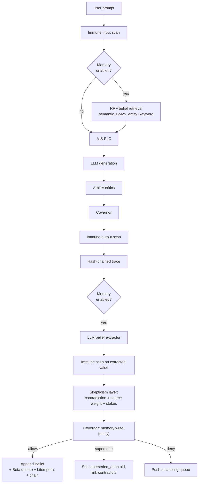

# Nexus Flagship Plan — Phase 12 (OSS Fame) + Phase 13 (Enterprise Revenue)

> **If you are a new agent session reading this file, start at section 0. It tells you exactly where we are and what to do next.**

---

## 0. Resume-Here (Agent Orientation)

**Current status:** Phase 12A Week 1 **DONE**. Phase 12A Week 2 **DONE**. Phase 12B Week 3 **DONE** — all six benchmarks + scanner hardening + nightly_benchmark workflow + `docs/benchmarks.md` shipped. Phase 12B Week 4 **IN PROGRESS** — `app/core/memory/integrity.py` + `GET /v1/memory/integrity` shipped (hash-chain verifier is now an externally-callable audit primitive; benchmark delegates to it). Baseline: **1361 passed, 0 skipped**. Remaining Week 4 work: dashboard routes, `nexus memory` CLI, README rewrite, docs/memory.md + integration docs, screencast script, launch playbook.
Shipped in Week 2: additive Alembic migration `d3cf357233d3` (beliefs_used /
beliefs_formed on traces + episodes, all nullable), `_retrieve_beliefs()`
and `_extract_and_persist_beliefs()` wired into `run_agent()`, trace +
episode rows now record which beliefs fed the answer and which new beliefs
resulted, `app/core/memory/forgetting.py` (pure `decay_belief`,
`effective_sample_size`-based tombstoning, `run_forget_sweep`,
`forget_by_entity`), and `app/api/memory.py` with five governed endpoints
(list / history / explain / forget / stats) mounted at `/v1/memory` and
`/api/memory`. All memory code is gated by `settings.MEMORY_ENABLED` —
when off, the regression tripwire (`tests/test_memory_regression.py`)
proves zero behavior drift. Baseline test count has grown from 1250 →
**1309 green, 0 skipped**.

**Next concrete action (Week 3 — finish the remaining 2 benchmarks + docs):**

1. Pull latest master. Run `pytest tests/ -q` — must show `1326 passed, 0
   skipped`. If the `memory-regression` CI job is red on your branch, STOP
   and read the Tier B diff before doing anything else — the golden
   fixture is the pre-memory behavioral contract.
2. Benchmarks already green: `tests/eval/temporal_qa.py`
   (6 tests), `tests/eval/contradiction_qa.py` (3 tests),
   `tests/eval/causal_qa.py` (3 tests), `tests/eval/tool_injection_redteam.py`
   (3 tests / 18 vectors / 10 categories), `tests/eval/skill_composition.py`
   (4 tests / 11 checks / governance moat demo), `tests/eval/agent_benchmark.py`
   (3 tests / 3 scenarios × memory-on/off / mock provider on CI gate, real
   provider opt-in for nightly). CLI pattern:
   `python -m tests.eval.<name> --json`. Report schemas are locked by
   `test_*_schema_stable` tests and every benchmark now exposes a
   uniform `passes_exit_gate: bool` key consumed by
   `.github/workflows/nightly_benchmark.yml`. When adding a new
   benchmark, include `passes_exit_gate` in its `to_json()` + schema
   test and add one row to the SPEC list in the nightly workflow.
   Each CLI also calls `tests.eval.reroute_logging_to_stderr()` at
   the top of `_main()` — do this in new benchmarks too, otherwise
   `configure_logging()` will corrupt `--json` output with log lines
   on stdout.
3. Nightly workflow (`.github/workflows/nightly_benchmark.yml`) runs
   all four green benchmarks on cron + `workflow_dispatch` + PRs that
   touch `tests/eval/`, `app/core/memory/`, `app/core/immune/`,
   `app/core/mcp/`, `app/agent/`, or `app/models/belief.py`. Non-
   gating (hard gates live in `ci.yml` `test-sqlite`); uploads JSON
   artifacts with 30-day retention, writes a summary table to the
   job summary, and posts/updates a PR comment via the built-in
   `GITHUB_TOKEN` (no third-party action). Badge in README.
   Diff-vs-last-green-main is deliberately deferred.
4. Remaining Week 3 work: none. `docs/benchmarks.md` is shipped
   (public-facing table built from the six benchmark JSON artifacts,
   framing is "Nexus-governed runtime vs unguarded agent runtime",
   no Mem0 column). Week 3 gate satisfied.
5. Docs (do after all benchmark code is in):
   - `docs/benchmarks.md` — headline table per benchmark, no Mem0
     column. Pull numbers from the nightly workflow's JSON artifacts
     rather than re-running locally to keep doc and CI in sync.
6. Do NOT touch the regression golden fixture without re-running the
   captured-from-`main` script and updating the Tier B test's scrub list
   in lockstep. The fixture is the proof-of-no-regression, so keep it
   sacrosanct.

**Small schema additions that landed in this checkpoint (so the next agent doesn't have to re-derive):**

- `BeliefDraft.derived_from: list[str] | None` — now plumbed through
  `write_belief()` into `Belief.derived_from`. Previously hardcoded to `[]`.
- `write_belief(..., observed_at=datetime | None)` — optional back-date
  override. Used only by benchmarks and historical-import paths.
  Runtime writers still MUST NOT pass it.
- `beliefs_as_of(db, at, …)` in `app/core/memory/retrieval.py` — the
  canonical bitemporal "what did we believe at T?" filter. **Enforces
  tz-aware `at`**: raises `ValueError` on naive datetimes to avoid
  backend-dependent answers under Postgres `TIMESTAMPTZ` with
  non-UTC server timezone. Flag-check runs first so `MEMORY_ENABLED=False`
  never surfaces the guard.
- `pyproject.toml [tool.pytest.ini_options].python_files` extended so
  `*_qa.py / *_benchmark.py / *_redteam.py / *_composition.py` files
  under `tests/eval/` get collected without the `test_` prefix. Any
  new benchmark must match one of those suffixes or add its own.
- `app/core/immune/scanner.py` now exports `is_tool_call_blocked(result)`:
  maps `FLAG → blocked` at the tool-call boundary because tool-call
  arguments don't get the `harden_prompt` fallback that free-text
  prompts do. Used by both `app/core/mcp/proxy.py` and
  `tests/eval/tool_injection_redteam.py` — keep them in sync via this
  helper, do not re-inline `verdict == "block"` checks at either site.
- `app/core/mcp/proxy.py` now serialises tool payloads with
  `json.dumps(..., ensure_ascii=False)`. Reverting this silently
  bypasses every CJK/Cyrillic/Arabic injection pattern in the
  scanner; the `tool_injection_redteam` benchmark will catch it.
- Scanner `INJECTION_PATTERNS` extended with four new families:
  jailbreak-mode keywords, secret-exfil intent, sensitive-path reads
  (`/etc/passwd`, `.ssh/id_rsa`, …), and shell-execution smuggling
  (`rm -rf /`, `curl|wget \S+ | bash|sh|zsh`). All narrow/high-precision
  to preserve the false-positive-resilience suite; see
  `tests/test_redteam.py::TestFalsePositiveResilience` before adjusting.

**What this document is:**
- Authoritative source of truth for the Nexus Flagship work stream
- Supersedes any earlier memory/agent-runtime discussion in this repo
- Split into **Phase 12 (OSS fame)** and **Phase 13 (enterprise revenue)**
- Phase 12 is further split into **12A (foundation, 2 calendar weeks)** and **12B (launch, 2 calendar weeks)** with a hard exit gate between them

**Most recent user decisions (locked):**
1. **Competitive target = OpenClaw + Hermes.** NOT Mem0. We do not build to beat Mem0 on retrieval benchmarks, and we do not reproduce LoCoMo/LongMemEval. Nexus's positioning is "the governed, self-improving runtime for the tools you already love."
2. Capacity: **40+ hours/week confirmed.** Calendar = 4 weeks for Phase 12, split 2wk + 2wk.
3. Scope: **FLAGSHIP** (dashboard + CLI + benchmarks + launch assets all in Phase 12B).
4. Embedding: **in-Python cosine over JSON arrays.** `pgvector` becomes an opt-in upgrade in Phase 12.5.
5. Extraction model: **reuse existing `app/core/llm/provider.py::generate`** with a new `EXTRACTION_MODEL` env var.
6. License: **Apache-2.0 through all of Phase 12.** Open-core split only happens in Phase 13.
7. Benchmarks: **synthetic-first.** TemporalQA + CausalQA + ContradictionQA (self-generated datasets) + a public agent benchmark subset (GAIA-lite or AgentBench subset) + skill-composition test using real ClawHub imports + tool-injection red-team. No Mem0 column in the results table.
8. Regression test: **two-tier contract test**, NOT byte-identical hash. (Traces have dynamic fields — byte-identical would be flaky from day 1.)

**Before starting any memory code, you MUST do this:**
1. Read [AGENTS.md](AGENTS.md) and [PROJECT_PLAN.md](PROJECT_PLAN.md) to understand the 11 completed phases.
2. Run `pytest tests/ -v --tb=short` to confirm current baseline (1250+ tests) is green. If a failure is inside `tests/test_memory_regression.py`, **stop and read the diff carefully** — the fixture at `tests/fixtures/pipeline_golden.json` is the pre-memory behavioral contract, and a failure there means the current change leaked memory behavior into the default path.
3. Read section 1 of this file — the non-negotiable rails.
4. Read section 2.5 — what we are NOT building.
5. Build in Week 1 order (section 3). The first five items in the Week 1 checklist are **already shipped** — resume at the first unchecked box.

**If the user says "continue" or "proceed" without further context, resume at the first unchecked task in section 7 (Progress Tracker). Update the tracker as you go.**

---

## 1. Upgrade-Not-Downgrade Guarantees (NON-NEGOTIABLE)

Every change in Phase 12 must obey these rails so we never regress Nexus's existing strengths (1181 tests on pre-memory baseline; hash chain, default-deny, zero-trust pipeline):

- **Opt-in only.** New `MEMORY_ENABLED: bool = False` in [app/config.py](app/config.py), following the exact pattern of `EXPOSE_METRICS: bool = False`. All memory code paths gated on this flag.
- **Additive migrations only.** New tables (`beliefs`, `meta_beliefs`) and new JSON columns (`beliefs_used`, `beliefs_formed`). Never alter or drop existing columns.
- **Routed through the existing pipeline.** Belief writes go `immune_scan -> extractor -> skepticism -> covernor_evaluate('memory:write:{entity}') -> hash-chain append`. Memory is not a bypass.
- **Hash chain extended, not replaced.** Belief gets `prev_hash`/`belief_hash` like [app/models/trace.py](app/models/trace.py).
- **Default-deny preserved globally.** New Covernor action namespaces `memory:write:*`, `memory:read:*`, `memory:forget:*` are ALL default-deny. We then seed **one explicit scoped allow policy** for `memory:write:user.preference.*` as a low-risk bootstrap so agents can learn basic preferences without manual approval setup. This is NOT a weakening of default-deny — it is an explicit scoped allow, the exact mechanism Covernor is designed around. All other memory scopes require explicit policies before they work. Wording matters: "global default-deny + one scoped allow for low-risk preferences," NEVER "default-allow for preferences."
- **No new required deps.** `rank-bm25` is pure Python. Embeddings use in-Python cosine over JSON arrays. `pgvector` is a Phase 12.5 opt-in upgrade, not a day-1 requirement.
- **Two-tier regression gate (REPLACES the naive byte-identical hash assertion):**
  - **Tier A — Schema + Behavior Invariance.** With `MEMORY_ENABLED=False`, assert: no `beliefs` table writes, no `beliefs_formed` column populated on new traces, no new Covernor `memory:*` policy evaluations fired, zero changes to existing trace column shapes, zero new log lines matching `memory`. Ignores all dynamic fields. Runs on every PR.
  - **Tier B — Fixture-Frozen Pipeline Parity.** Monkey-patch `datetime.now`, mock the LLM provider to return deterministic output, pin `latency_ms` and `model_id`, stub `request_id`. With those frozen, assert the full trace body minus an explicit dynamic-field allowlist is byte-identical to a golden fixture captured on main BEFORE any memory code landed. Required to pass before merging any memory PR.
  - This is the actual tripwire. Byte-identical alone would be flaky because of timestamps, latency, token counts, request IDs, etc.
- **Keep the moats visible.** Every memory feature must be *more* governed than any competing runtime, not less. The skepticism layer + Covernor-on-writes IS the brand differentiator.

---

## 2. Architectural Fit

Every arrow above reuses existing Nexus machinery. Memory is a first-class but **governed** citizen.

---

## 2.5. Positioning (the "why" — read before writing any code)

### What we are NOT

- NOT a Mem0 alternative. Not our fight.
- NOT building to beat LoCoMo / LongMemEval benchmarks.
- NOT building a skill marketplace. OpenClaw already exists and is good.
- NOT building a function-calling LLM. Hermes already exists and is good.

### What we ARE

- **The governed, self-improving RUNTIME** for agents that already love OpenClaw and Hermes.
- **OpenClaw-compatible by design.** Nexus already imports SKILL.md via `/api/skills/import` (Phase 11). Phase 12 makes imported skills *smarter* (memory-aware retrieval ranks them) and *safer* (every execution step goes through immune scan + Covernor + critic tree + hash-chain audit).
- **Hermes-compatible by design.** Any Hermes function-calling model plugs in via the existing provider chain (`LOCAL_HF_MODEL_ID` already supports HuggingFace models). Nexus provides the runtime they're missing: immune scan, Covernor governance, critic arbitration, audit chain, learning loop.
- **The learning layer neither has.** OpenClaw skills are static. Hermes models don't learn across runs. Nexus's Episode + Belief + Skill reward-tracking + skepticism layer is the closed learning loop nobody else ships.

### Positioning headline (for README + HN launch)

> **Nexus — the governed, self-improving agent runtime.**
> Runs every OpenClaw skill safely. Plugs in any Hermes-class model.
> Learns from every run. Answers "why did I do X?" with a cryptographically-signed audit chain.
> The zero-trust runtime layer OpenClaw and Hermes were missing.

### Killer demos (the things that go in the screencast)

1. **"Safe OpenClaw":** `nexus skills import https://clawhub.../some-skill.md` → run it → show full audit chain, Covernor decisions per step, critic scores, episodic reflection written to memory.
2. **"Why did I do X?":** Agent answers a follow-up question by returning the derivation DAG (belief causal chain). Nobody in OSS ships this.
3. **"The agent changed its mind":** Inject a contradictory user statement → show Beta confidence update → old belief `superseded_at` set → audit log entry → retrieval now returns the new belief.
4. **"Adversarial tool injection blocked":** Show a prompt-injection payload targeting a ClawHub skill → Covernor blocks → labeling queue receives it → future fine-tune downstream.

---

## 3. PHASE 12A — Foundation (2 calendar weeks, ~80 hours)

**Goal:** Governed memory system running internally, fully tested, zero regression on existing 1181 baseline tests. NOT yet launched.

### Week 1 — Regression Tripwire + Belief Foundation

**Ship these FIRST (before any memory logic exists):**
- [x] Add `MEMORY_ENABLED: bool = False` to [app/config.py](app/config.py)
- [x] Add `EXTRACTION_MODEL: str = ""` to config
- [x] Add `MEMORY_STAKES_THRESHOLDS: str = "identity=0.9,financial=0.85,preference=0.5,state=0.3"`
- [x] Add `MEMORY_DECAY_PROFILE: str = "identity=inf,preference=180d,state=4h,context=1h"`
- [x] (Bonus) Added `MEMORY_RETRIEVAL_LIMIT=5` and `MEMORY_EXTRACTOR_MAX_CHARS=8000` for retrieval defaults and extractor cost control
- [x] Capture golden fixture from `main` for Tier B (at [tests/fixtures/pipeline_golden.json](tests/fixtures/pipeline_golden.json)) BEFORE any memory code lands — **self-tested by mutating the golden and confirming the test trips**
- [x] Write `tests/test_memory_regression.py` with BOTH tiers implemented and passing
- [ ] CI gate: both tiers required on every PR touching `app/` ← `.github/workflows/` wiring still pending

Then build the Belief foundation:
- [x] [app/models/belief.py](app/models/belief.py) — Belief model (bitemporal + Beta + provenance + causal + hash chain + `rationale` field for the `/explain` API)
- [x] Register in [app/models/__init__.py](app/models/__init__.py)
- [x] [app/core/memory/__init__.py](app/core/memory/__init__.py) — package scaffolding
- [x] [app/core/memory/confidence.py](app/core/memory/confidence.py) — Beta primitive (+ 13 unit tests in `tests/test_memory_confidence.py`)
- [x] [app/core/memory/extractor.py](app/core/memory/extractor.py) — constrained-schema LLM extractor (version-stamped `EXTRACTOR_VERSION="v1.0.0-preference"`, robust JSON parsing with fenced-block + surrounding-text fallback, MAX_CHARS clipping, max-8 drafts cap, never raises) (+ 18 unit tests in `tests/test_memory_extractor.py`)
- [x] [app/core/memory/skepticism.py](app/core/memory/skepticism.py) — contradiction + source + stakes checks (+ 10 unit tests in `tests/test_memory_skepticism.py`). `BeliefDraft` extended with scope fields (`user_id`, `session_id`, `agent_id`), retrieval signals (`keywords`, `embedding`), and `rationale`.
- [x] [app/core/memory/retrieval.py](app/core/memory/retrieval.py) — RRF over cosine + lexical + entity + episodic + confidence signals (+ 9 unit tests in `tests/test_memory_retrieval.py`)
- [x] [app/core/memory/writer.py](app/core/memory/writer.py) — governed write path: feature-flag inert → load priors → `skepticism.evaluate` → `Covernor.evaluate_action("memory:write:{entity_type}")` → per-user hash chain (`prev_hash`/`belief_hash`) → persist + mark superseded. `WriteOutcome` dataclass exposes skepticism + policy decisions for audit. Never raises on policy/skepticism outcomes; DB errors roll back cleanly. (+ 13 integration tests in `tests/test_memory_writer.py`)
- [x] `alembic/versions/8a4579763b4d_add_beliefs_table_for_phase_12_memory_.py` — additive migration (up/down/up cycle verified)
- [x] Covernor `memory:*` namespace with global default-deny + ONE scoped allow for `memory:write:preference` seeded in `app/main.py` lifespan via `_seed_memory_policies()` (idempotent by policy name, runs alongside existing `_seed_mcp_policies`). Non-preference entity types stay default-deny.
- [x] `test_memory_governed_writes.py` equivalent shipped as `tests/test_memory_writer.py` (13 tests covering feature flag, skepticism gate, Covernor allow/deny, hash chain per-user isolation, supersession, provenance, batch writes)

### Week 2 — Bitemporal + Causal + Forgetting + Agent-Loop Wiring

- [ ] [app/api/memory.py](app/api/memory.py) mounted under `/v1/` and `/api/`:
  - `GET /v1/memory/beliefs` (list with filters)
  - `GET /v1/memory/beliefs/{id}/history` (bitemporal)
  - `GET /v1/memory/beliefs/{id}/explain` (derivation DAG as JSON + mermaid)
  - `POST /v1/memory/forget` (tombstone + audit)
  - `GET /v1/memory/stats`
- [ ] Additive migrations: `traces.beliefs_formed`, `episodes.beliefs_used`, `episodes.beliefs_formed`
- [ ] [app/agent/agent_loop.py](app/agent/agent_loop.py) — add `_retrieve_beliefs()` mirroring `_retrieve_episodes` at lines 61-92; inject into system prompt; after `final_answer`, fire extractor → writer
- [ ] [app/core/memory/forgetting.py](app/core/memory/forgetting.py) — per-entity-type decay every 12 scheduler cycles; tombstone → audit_export with `event_type: "memory_forgotten"`
- [ ] Tests: `test_bitemporal_queries.py`, `test_causal_explain.py`, `test_forgetting_decay.py`, `test_gdpr_tombstone.py`, `test_memory_api.py`

### Phase 12A Exit Gate (ALL must pass before starting 12B)

- [ ] All existing 1181 baseline tests still green
- [ ] Regression Tier A green
- [ ] Regression Tier B green (frozen fixture match)
- [ ] All new memory tests green
- [ ] Manual smoke: run agent with `MEMORY_ENABLED=True` — belief created, retrieved, updated, superseded, tombstoned end-to-end
- [ ] Manual smoke: run agent with `MEMORY_ENABLED=False` — verify zero memory code paths touched (Tier A confirms)
- [ ] Latency benchmark recorded: p50 with memory on ≤ 2x memory off; p99 ≤ 4x
- [ ] `docs/memory.md` drafted (polish happens in 12B)

**If any exit criterion fails, extend 12A. Do not start 12B on a broken foundation. This is the hard gate.**

---

## 4. PHASE 12B — Benchmarks + Dashboard + CLI + Launch (2 calendar weeks, ~80 hours)

**Goal:** Public launch-ready. HN post drafted. Benchmark numbers in hand. Dashboard + CLI shippable.

### Week 3 — Synthetic-First Benchmarks (aligned to positioning, not to Mem0)

We do NOT reproduce Mem0 / LoCoMo / LongMemEval. Focus on benchmarks that prove the OpenClaw/Hermes runtime story:

- [x] `tests/eval/temporal_qa.py` — synthetic bitemporal recall. 5 parametrized seeds × 1–5 transitions each. All 6 assertions pass at 100% accuracy (exit gate). CLI: `python -m tests.eval.temporal_qa --json`. Added `beliefs_as_of(db, at, …)` helper in `app/core/memory/retrieval.py` (canonical `observed_at <= at AND (superseded_at IS NULL OR superseded_at > at)` filter) and an optional `observed_at` override on `write_belief()` so benchmarks can reconstruct a back-dated timeline deterministically. pyproject.toml `python_files` extended with `*_qa.py / *_benchmark.py / *_redteam.py / *_composition.py` so category-named benchmark files are discovered without the `test_` prefix.
- [x] `tests/eval/causal_qa.py` — "Why did you believe X?" derivation DAG over `Belief.derived_from`. Added `BeliefDraft.derived_from: list[str] | None` field + threaded it through `write_belief` (previous writer hardcoded `[]`). Scenario is a 3-level DAG (3 roots → 2 mid-level derivations → 1 leaf) and the benchmark proves: (a) every derived belief has ≥1 ancestor, (b) BFS closure reaches every root from the deepest leaf, (c) no dangling parent ids, (d) no cycles. Adds a scoped `memory-allow-fact-write` policy (priority 50) in the benchmark fixture since the default seed only allows `memory:write:preference`. 3 tests green at 100% exit gate. CLI: `python -m tests.eval.causal_qa --json`.
- [x] `tests/eval/contradiction_qa.py` — inject conflicting facts across every skepticism verdict (accept / reject / supersede / needs_evidence), verify (a) verdict matches expectation, (b) per-user hash chain reproduces byte-for-byte (`belief_hash` = sha256 of prev_hash + id + triple + source + source_trace_id + tz-normalized observed_at), (c) single-byte tampering is detected, (d) bidirectional causal links between superseded row and challenger. Three tests green at 100% exit gate. Recomputation helper normalizes SQLite's naive-datetime round-trip back to UTC and uses the `"genesis"` sentinel for first-row `prev_hash` to match `writer._HASH_GENESIS`. CLI: `python -m tests.eval.contradiction_qa --json`.
- [x] `tests/eval/agent_benchmark.py` — three curated scenarios (multi-turn recall, tool-use reasoning with memory-as-cache, preference learning) driven through the real `app.agent.agent_loop.run_agent`. Mock provider monkey-patches `agent_loop.generate`, `agent_loop._resolve_route` (forces non-mock branch), and `memory.extractor.generate` — all three patch sites documented inline because missing any one silently degrades the benchmark to meaningless zeros. Each scenario runs twice (MEMORY_ENABLED=False, then True) against the same test DB but with unique user_ids per mode so retrieval only sees beliefs the same run planted. Tool-use scenario deletes the fixture file between turn 1 and turn 2 so memory-off PROVABLY cannot answer without recalling the belief. Exit gate: `uplift ≥ 0.10` (with-memory final-turn avg minus without-memory final-turn avg) AND `average_with_memory > 0` to reject the both-fail-at-zero pathology. First-run score is `uplift=1.000` across all three scenarios (off=0.0, on=1.0 on the test turn in every case). `--provider real` mode opt-in for nightly; emits a structured `skipped` JSON row when no `GEMINI_API_KEY`/`OPENAI_API_KEY`/`DEEPSEEK_API_KEY` is configured so the workflow doesn't crash. CLI: `python -m tests.eval.agent_benchmark --json [--provider mock|real]`. Wired into the nightly workflow SPEC. Key debug lesson recorded: `run_agent` formats tool results as `"Tool <name> result:"` in the main loop and `"Tool result (<name>):"` on the resume-from-approval path — the mock parser matches BOTH so tool-call output is never mistaken for a user utterance.
- [x] `tests/eval/skill_composition.py` — imports 3 SKILL.md payloads through the real `clawhub_import.import_skill_md` code path (same as `POST /v1/skills/import`), then chains them via the real `skills.execute_skill` loop so every tool_call passes through Covernor. The chain is a tiny data-processing pipeline in a shared tmp workspace: `skillcomp-setup` writes `config.json`, `skillcomp-process` consumes it and emits `result.txt`, `skillcomp-summarize` emits `summary.md`. Three benign skills × {imported, executed, artifact_present} = 9 checks. Plus a 4th `skillcomp-exfil-attempt` SKILL.md that tries `cat /etc/passwd > leaked.txt` — the immune scanner only FLAGs it (single pattern, score 0.4, not a block), so the hostile skill imports exactly like an operator would see; the benchmark then seeds `bench-deny-sensitive-path` / `-shadow` / `-ssh` Covernor policies and verifies (a) the `shell_exec` step is denied at execution, (b) `leaked.txt` is NOT present in the workspace. Hostile × {imported, exec_denied} = 2 checks. Total 11; exit gate ≥ 0.85 (i.e. ≥ 10/11). First-run score is 11/11. This is the benchmark that directly backs the "Nexus is safer runtime for ClawHub skills than OpenClaw/Hermes" positioning — the governance moat shows up as a post-import, per-step deny rather than a blunt static-scan rejection, which is the realistic threat model operators actually face. CLI: `python -m tests.eval.skill_composition --json`. Wired into the nightly workflow SPEC.
- [x] `tests/eval/tool_injection_redteam.py` — 18 attack vectors across 10 categories (role_override, multi_language, unicode_obfuscation, secret_exfil, shell_smuggling, nested_payload, hypothetical, tool_chaining, schema_override, compound). 100% effective block rate at the MCP tool-call boundary. Writing this benchmark surfaced two real security gaps that also shipped in this checkpoint: (i) the MCP proxy was calling `json.dumps(..., default=str)` without `ensure_ascii=False`, which escaped CJK/Cyrillic/Arabic attack text to `\uXXXX` and silently bypassed every multi-language injection pattern — `app/core/mcp/proxy.py` now uses `ensure_ascii=False`; (ii) the proxy was treating `FLAG` the same as `PASS` even though tool-call arguments get no `harden_prompt` fallback, so a detected-but-mitigated verdict at that boundary was actually detected-and-forwarded. Added `is_tool_call_blocked(result)` helper in `app/core/immune/scanner.py` and wired it into the proxy so FLAG now blocks at the tool-call boundary; the benchmark's "effective block" semantics use the same helper so proxy and benchmark can never drift. Scanner also grew four new injection-pattern families (jailbreak mode keywords, secret-exfil intent, sensitive-path reads like `/etc/passwd` / `.ssh/id_rsa`, shell-execution smuggling like `rm -rf /` and `curl | bash`). All existing false-positive-resilience tests still pass (multilingual greetings, "ignore whitespace in regex", etc.). CLI: `python -m tests.eval.tool_injection_redteam --json`.
- [x] [docs/benchmarks.md](docs/benchmarks.md) — public results page shipped. One headline table + a per-benchmark section (what it proves, exit gate, current JSON payload, reproduce CLI + pytest commands). Framing is "Nexus-governed runtime vs unguarded agent runtime"; no Mem0 column. Includes an explicit non-goals section (no Mem0 column, no LoCoMo/LongMemEval reproduction) and a progression-vs-regression callout distinguishing these six gates from the `tests/test_memory_regression.py` tripwire. Numbers are pulled from the nightly workflow's `bench-reports/*.json` artifacts so the doc and CI never drift. Linked from the main README Table of Contents.
- [x] `.github/workflows/nightly_benchmark.yml` — runs the four green benchmarks (`temporal_qa`, `contradiction_qa`, `causal_qa`, `tool_injection_redteam`) as CLI `--json` every night at 02:15 UTC, on `workflow_dispatch`, and on PRs touching `tests/eval/`, `app/core/memory/`, `app/core/immune/`, `app/core/mcp/`, `app/agent/`, or `app/models/belief.py`. Uploads JSON artifacts (30-day retention), writes a summary table to `$GITHUB_STEP_SUMMARY`, and posts/updates a PR comment via the built-in `GITHUB_TOKEN` (no third-party action). Non-gating by design — the hard exit gates still live in the main `test-sqlite` CI job; this workflow is for trend tracking and public-facing numbers. Diff-vs-last-green-main is deliberately deferred (requires cross-workflow artifact download; add later if signal-to-noise requires it). Badge added to README. Uniform `passes_exit_gate: bool` key now lives in every benchmark's JSON output (`temporal_qa` and `tool_injection_redteam` gained it; `contradiction_qa` and `causal_qa` already had it) so a single workflow spec covers all four benchmarks and future additions drop in by adding one row. Also hardened the `--json` contract: each benchmark's `_main()` now calls `tests.eval.reroute_logging_to_stderr()` at entry to keep stdout parseable — `app.main.configure_logging()` sends logs to stdout by design (production JSON-log convention), which silently poisoned the `--json` output until this fix.

### Phase 12B Exit Gate (ALL must pass before launching)

- [ ] Agent benchmark: Nexus-with-memory scores ≥ 10% higher than Nexus-without-memory on the subset
- [ ] Skill composition: ≥ 85% success rate on 3-skill ClawHub chain
- [ ] Tool injection red-team: 100% block rate on known-attack signatures
- [ ] Causal QA: 100% returns valid non-empty derivation DAG
- [ ] Temporal QA: 100% correct belief-at-time-T queries on the synthetic set
- [ ] Contradiction QA: 100% correct supersession + audit log write

**If exit gate fails: extend 12B, do NOT launch. An underpowered launch is worse than a delayed one.**

### Week 4 — Dashboard, CLI, Launch

- [x] `app/core/memory/integrity.py` + `GET /v1/memory/integrity` — promoted
  `contradiction_qa._recompute_hash` + `_verify_chain` to a production
  `IntegrityResult`-returning module. Supports per-user scope,
  whole-store audit mode (default sentinel), and bitemporal `as_of`
  restriction (tz-aware enforced, same as `beliefs_as_of`). Route
  mounted at `/v1/memory/integrity` and `/api/memory/integrity`,
  Covernor-gated on `memory:read:integrity` with a default-allow
  policy (`memory-allow-integrity-read`, priority 20, risk_level=low)
  seeded by `_seed_memory_policies`. Broken chains surface as 200 +
  `verified=false` (audit finding, not HTTP error); missing policy
  surfaces as structured 403. `tests/eval/contradiction_qa._verify_chain`
  now delegates to the production module so the benchmark and the
  runtime stay in byte-for-byte sync. 28 new tests
  (`tests/test_memory_integrity.py`) cover happy path, tamper detection
  on every hashed field, per-user isolation, NULL-user chain, audit
  mode, `as_of` boundaries, governance gate, and 400/403/503 edge
  cases. Full suite: **1361 passed, 0 skipped**.
- [ ] [app/templates/memory.html](app/templates/memory.html) + dashboard routes:
  - `/dashboard/memory` — belief count, Beta confidence histogram, contradiction log, meta-memory leaderboard
  - `/dashboard/memory/{id}` — belief detail with mermaid DAG of derivation
  - `/dashboard/memory/timeline` — bitemporal explorer ("scrub to a date, see what the agent believed")
  - `/dashboard/memory/integrity` — one-click "verify my chain" button backed by the new API
- [ ] [app/cli.py](app/cli.py) — `nexus memory` command group: `remember`, `recall`, `history`, `explain`, `forget`, `bench`, `verify` (calls `/v1/memory/integrity`)
- [ ] [README.md](README.md) rewrite aligned to the new positioning (runtime-for-OpenClaw-skills + Hermes-compatible + learning loop)
- [ ] [docs/memory.md](docs/memory.md) — polished architecture doc with section-2 mermaid
- [ ] `docs/openclaw_integration.md` — "How to safely run any ClawHub skill in Nexus"
- [ ] `docs/hermes_integration.md` — "How to run any Hermes function-calling model in Nexus"
- [ ] `docs/demo/screencast.md` — 10-minute script following the 4 killer demos from section 2.5
- [ ] `docs/fame_playbook.md` — internal HN / Reddit / Twitter launch checklist
- [ ] Show HN post drafted and reviewed

### Phase 12 Launch Exit Criteria (ALL must pass to publish)

- [ ] 12A exit gate + 12B exit gate both ALL green
- [ ] Show HN post passes 3 trusted reviewers
- [ ] README passes 5-second "what does this do" test on someone who's never heard of Nexus
- [ ] 60-second Docker quickstart works on a fresh machine (actually tested, not assumed)
- [ ] At least 1 real ClawHub skill runs end-to-end in the demo
- [ ] At least 1 Hermes-class model runs successfully via `LOCAL_HF_MODEL_ID`

---

## 5. PHASE 13 — Government / Bank / Revenue (post-fame, ~10-12 weeks)

### Phase 13 Gate (ALL must be true to trigger — otherwise stay in Phase 12.5 polish mode)

- [ ] 500+ GitHub stars
- [ ] 3+ pilot users actively deployed and reporting back
- [ ] 1+ paid design partner signed (LOI or contract)
- [ ] SOC2 Type I readiness checklist baseline started
- [ ] 6+ months financial runway available for Phase 13 build

Without all 5, do not prematurely pivot to enterprise. Premature B2B pivots kill OSS projects.

### License Strategy (for a solo unknown dev wanting fame first, revenue later)

**Open-core with delayed activation.**

- Phase 12 stays 100% Apache-2.0. Zero relicensing drama during the fame phase.
- Phase 13 trigger (gate above): create **separate private repo `nexus-enterprise`** holding commercial modules. Core stays Apache. GitLab EE / Sentry model.
- Optional Phase 13b (after first $50K ARR): apply FSL (Functional Source License) to NEW high-value modules only. Never the core, never retroactively. Protects against AWS strip-mining.

Why not the other options:
- Apache-only SaaS: weakest moat; solo dev can't win pure SaaS race vs hyperscalers.
- AGPL core: scares enterprise procurement (many have "no AGPL" policies). Bad for fame.
- BSL from day 1: immediate "not really open source" controversy. Kills fame before it starts.

### What regulated buyers pay for (in price-tolerance order)

**Top tier (6-7 figures ACV):**
- FedRAMP / SOC2-ready deployment bundle with pre-mapped controls
- Multi-tenant isolation with per-tenant encryption keys
- HSM/KMS-backed K-of-N approvals (extends existing ECDSA in [app/core/covernor/token_manager.py](app/core/covernor/token_manager.py))
- Air-gapped on-prem install (Docker Compose + Postgres profile already exists)
- Data residency / regional deployments
- Belief-level access policies with classification labels (Secret/Confidential/Public) — extends Covernor to memory

**Mid tier (5-6 figures ACV):**
- SSO (SAML / OIDC)
- RBAC with audit
- Legal hold + e-discovery export (builds on existing [app/services/audit_export.py](app/services/audit_export.py))
- GRC policy packs: HIPAA, FINRA, GDPR, SOX, PCI-DSS, FedRAMP
- Splunk / Datadog / ServiceNow connectors
- 24/7 SLA with security-cleared engineers

**Entry tier ($10-30K ACV):**
- Nexus Cloud managed SaaS
- Doctrine Lab training-data subscriptions
- Audit certification help

### Monetization models (ranked by margin for a solo founder)

**1. GRC Policy Packs — highest margin, easiest to sell.** Code is small; mapping work is what buyers pay for.
- HIPAA Pack: $5K/yr — pre-seeded policies, PHI-safe templates, BAAs
- FedRAMP Pack: $15K/yr — FIPS-140-2 enforced, STIG templates, audit artifacts
- FINRA Pack: $10K/yr — trading-intent critics, MNPI leak patterns
- GDPR Pack: $3K/yr — auto-right-to-erasure, consent tracking
- SOC2 Pack: $5K/yr — continuous controls monitoring

**2. Commercial "Nexus Enterprise" add-ons — GitLab EE model**
- SSO Module: $5K/yr per 100 seats
- Multi-Tenant: $20K/yr base + per-tenant
- HSM Module: $10K/yr
- Advanced Memory Governance (belief-level ACLs + classification): $15K/yr — unique to Nexus

**3. Nexus Cloud (hosted SaaS)**
- Free: 1K belief writes/mo
- Pro: $99/mo — 100K writes
- Team: $499/mo — 1M writes + SSO
- Enterprise: custom — unlimited + dedicated

**4. Services / Support** — required for any government deal
- Implementation: $20K per engagement
- 24/7 SLA: $50K/yr minimum
- Security-cleared engineers: premium hourly

**5. Doctrine Lab training-data subscriptions** — leverages existing 145 adversarial tests + benchmark harness
- Red-team dataset: $5K-$50K/yr
- Quarterly "latest attack vectors" releases
- Custom domain datasets

### Phase 13 build order (10-12 weeks post-fame, AFTER the gate is met)

- [ ] Weeks 1-2: SSO (SAML/OIDC) + RBAC in separate `nexus-enterprise` repo under commercial license. Sellable immediately.
- [ ] Weeks 3-4: Multi-tenant isolation — `tenant_id` on Trace/Belief/Episode/Skill, scoped DB sessions, per-tenant encryption.
- [ ] Weeks 5-6: Belief-level access policies + classification labels. Unique selling point.
- [ ] Weeks 7-8: GRC pack framework + ship HIPAA first ($5K/yr subscription).
- [ ] Weeks 9-10: HSM/KMS integration (AWS KMS, Azure Key Vault, HashiCorp Vault, PKCS#11).
- [ ] Weeks 11-12: Nexus Cloud MVP on Cloudflare Workers or Fly.io + Stripe billing.

### Realistic revenue trajectory (with sales-cycle reality)

Regulated industry sales cycles are 6-18 months. The "$80-150K Year 1" figure assumes ALL of:
- Fame achieved first (500+ stars, HN front page)
- Pilot users converted (usually 10-20% of serious pilots become paying)
- No major incidents in pilot phase
- Focused GTM effort, not part-time

Honest timeline:
- Month 0-3 post-fame: build enterprise features, no revenue
- Month 3-6: first pilot signed, usually free or $5K/yr
- Month 6-9: first paid design partner
- Month 9-12: first $50K+ deal (likely gov services engagement, not recurring)
- Month 12-18: recurring revenue starts to compound
- Year 2: $300-500K ARR plausible
- Year 3: $1M+ ARR possible with 3-5 GRC packs shipped

First 3 realistic revenue targets:
1. Healthcare startup on HIPAA pack: **$5K ARR** (month 6-9)
2. Fintech on FINRA pack + SSO: **$15K ARR** (month 9-12)
3. Government contractor pilot (FedRAMP pack + air-gap services): **$50K services + $15K ARR** (month 12-15)

Do NOT plan Phase 13 timing assuming month-3 revenue. That's fantasy for a solo founder in regulated industries.

---

## 6. Explicit Non-Goals

- **Beating Mem0 on LoCoMo / LongMemEval.** Not our fight. Not our target market.
- **Reproducing Mem0 features 1:1.** We borrow concepts (bitemporal, Beta confidence) only where they help our runtime story.
- **Building a skill marketplace.** OpenClaw already exists and we're compatible with it.
- **Building a function-calling LLM.** Hermes (and others) already exist and we plug them in.
- Neo4j / Apache AGE graph — Postgres JSONB covers 80% until benchmarks say otherwise.
- Cross-agent shared memory — defer to Phase 13.
- Full consolidation worker — stub only in Phase 12; full worker in Phase 13 if needed.
- Custom embedding model — use existing provider chain.
- `pgvector` required — Phase 12.5 opt-in upgrade only.
- Relicensing the core during Phase 12 — forbidden until after 500 stars AND enterprise gate met.
- Month-3 Phase 13 revenue expectations — gov/bank deals take 6-18 months.

---

## 7. Progress Tracker (update as you go)

### Phase 12A — Foundation (2 calendar weeks)

**Week 1 — Regression Tripwire + Belief Foundation (DONE)**
- [x] `MEMORY_ENABLED=False` flag + 5 new config vars (plan had 3; added 2 bonus retrieval/extractor knobs)
- [x] Golden fixture captured from main branch ([tests/fixtures/pipeline_golden.json](tests/fixtures/pipeline_golden.json))
- [x] `tests/test_memory_regression.py` — Tier A (5 tests) + Tier B (1 test) both green, tripwire self-verified via golden mutation
- [x] CI wiring for regression gate — dedicated `memory-regression` job in [.github/workflows/ci.yml](.github/workflows/ci.yml), runs after `lint`, SQLite-only (behavioral contract, not dialect portability), explicitly exports `MEMORY_ENABLED=false`, surfaces as its own status check on PRs, re-verified tripwire behavior by mutating the golden and confirming Tier B fails
- [x] `app/models/belief.py` + register + additive migration (revision `8a4579763b4d`)
- [x] `app/core/memory/confidence.py` (Beta primitive) + 13 tests
- [x] `app/core/memory/extractor.py` (LLM-backed JSON triple extraction, version-stamped) + 18 tests
- [x] `app/core/memory/skepticism.py` + 10 tests
- [x] `app/core/memory/retrieval.py` + 9 tests
- [x] `app/core/memory/writer.py` (skepticism → Covernor → hash-chain → persist, per-user chains) + 13 tests
- [x] Covernor `memory:*` namespace with default-deny + scoped allow (`_seed_memory_policies` in `app/main.py`, wired into lifespan)
- [x] All Week 1 tests green so far: **1250 passed, 0 skipped** (baseline 1181 + 69 new memory tests)

**Week 2 — Bitemporal + Causal + Forgetting + Agent-Loop Wiring**
- [x] Additive columns: `traces.beliefs_used`, `traces.beliefs_formed`, `episodes.beliefs_used`, `episodes.beliefs_formed` (Alembic `d3cf357233d3`)
- [x] `_retrieve_beliefs()` in `agent_loop.py` — RRF-backed, flag-gated, user-scoped, superseded-row-aware
- [x] Extractor fires after `final_answer` → skepticism gate → writer (`_extract_and_persist_beliefs`), belief IDs recorded on Trace + Episode
- [x] `app/core/memory/forgetting.py` — pure `decay_belief` + `effective_sample_size`, `run_forget_sweep`, `forget_by_entity`
- [x] `app/api/memory.py` endpoints — `GET /memory` (list), `GET /memory/{id}/history`, `GET /memory/{id}/explain`, `POST /memory/forget`, `GET /memory/stats` — mounted at both `/v1/memory` and `/api/memory`, structured 503 when flag off (except `stats` which reports enabled=false)
- [x] All Week 2 tests green: **1309 passed, 0 skipped** (baseline 1250 → +59 memory tests across agent-loop wiring, forgetting, and API)

**12A Exit Gate**
- [ ] All 1181 baseline tests green
- [ ] Regression Tier A green
- [ ] Regression Tier B green
- [ ] All new memory tests green
- [ ] Smoke test: memory-on end-to-end workflow
- [ ] Smoke test: memory-off produces identical behavior
- [ ] Latency p50 ≤ 2x, p99 ≤ 4x
- [ ] `docs/memory.md` drafted

### Phase 12B — Benchmarks + Launch (2 calendar weeks)

**Week 3 — Synthetic-First Benchmarks**
- [ ] `tests/eval/temporal_qa.py`
- [ ] `tests/eval/causal_qa.py`
- [x] `tests/eval/contradiction_qa.py`
- [x] `tests/eval/agent_benchmark.py` (three-scenario curated task set, dual mock+real provider)
- [x] `tests/eval/skill_composition.py` (3-skill ClawHub chain + hostile exfil probe)
- [x] `tests/eval/tool_injection_redteam.py`
- [x] `docs/benchmarks.md` with public results
- [x] `.github/workflows/nightly_benchmark.yml`

**12B Benchmark Exit Gate**
- [ ] Agent benchmark: ≥ 10% improvement with memory vs without
- [ ] Skill composition: ≥ 85% success on 3-skill chain
- [ ] Tool injection: 100% block on known-attack signatures
- [ ] Causal QA: 100% valid DAG
- [ ] Temporal QA: 100% correct
- [ ] Contradiction QA: 100% correct supersession + audit

**Week 4 — Dashboard + CLI + Launch**
- [ ] `/dashboard/memory` UI (histogram + DAG + timeline)
- [ ] `nexus memory` CLI commands
- [ ] `README.md` rewrite (new positioning)
- [ ] `docs/memory.md` polished
- [ ] `docs/openclaw_integration.md`
- [ ] `docs/hermes_integration.md`
- [ ] `docs/demo/screencast.md`
- [ ] `docs/fame_playbook.md`
- [ ] Show HN post drafted

**Launch Exit Gate**
- [ ] All 12A + 12B gates green
- [ ] HN post peer-reviewed
- [ ] README 5-second-test passed
- [ ] 60-second Docker quickstart works on fresh machine
- [ ] 1 real ClawHub skill demo runs end-to-end
- [ ] 1 Hermes model runs via `LOCAL_HF_MODEL_ID`

### Phase 13 — Enterprise Revenue (only after gate)

- [ ] Gate conditions (ALL 5) met
- [ ] Weeks 1-2: SSO + RBAC
- [ ] Weeks 3-4: Multi-tenant
- [ ] Weeks 5-6: Belief-level ACL
- [ ] Weeks 7-8: GRC framework + HIPAA pack
- [ ] Weeks 9-10: HSM/KMS integration
- [ ] Weeks 11-12: Nexus Cloud MVP + Stripe

---

## 8. Risks + Mitigations

- **Extraction quality dominates results.** Phase 12A ships with ONE entity type (`user.preference.*`). Benchmark before expanding.
- **Write latency 3-5x baseline.** Measure in Week 1; async write queue if p99 > 4x.
- **Storage overhead ~5x.** Decay + tombstone live from Week 2; consolidation worker stubbed.
- **Benchmark reproducibility was a real risk under the old Mem0 framing.** Now synthetic-first → self-generated datasets, fully under our control. Risk neutralized.
- **Community reaction to governance overhead.** `MEMORY_ENABLED=False` default; opt-in; governance IS the pitch for regulated buyers later.
- **OpenClaw API / SKILL.md format changes.** Stable format; we store `raw_source` verbatim; decoupled from their live API.
- **Hermes model compatibility.** Plugs into existing `LOCAL_HF_MODEL_ID` path; standard HuggingFace transformers loading; no custom adapter needed day 1.
- **Positioning confusion (are we memory? runtime? framework?).** Section 2.5 explicit non-goals + README + HN post all say "runtime for OpenClaw skills + Hermes models." Stay disciplined on messaging.
- **Solo burnout at 40h/week for 4 weeks.** Exit gates include "extend if not ready" clauses. No rushing.
- **Enterprise sales cycle (Phase 13).** Gov/bank deals take 6-18 months. Section 5 revenue timeline updated to honest numbers.
- **OpenClaw or Hermes pivoting into runtime themselves.** Our moat is the zero-trust pipeline + 11-language immune + Covernor + critic tree + audit chain — 12+ months of prior work they'd need to replicate.

---

## 9. Decision Log

- **2026-04-17** — Scope = FLAGSHIP (4 weeks). User chose over MINIMAL / COMPETITIVE.
- **2026-04-17** — Embedding = in-Python cosine, not pgvector. Ship speed > infra.
- **2026-04-17** — Extractor reuses existing provider chain with `EXTRACTION_MODEL` override.
- **2026-04-17** — Phase 12 stays Apache-2.0. Relicense only after 500-star gate.
- **2026-04-17** — Phase 13 = open-core with separate `nexus-enterprise` repo (GitLab EE model).
- **2026-04-17** — `MEMORY_ENABLED=False` default for zero-regression guarantee.
- **2026-04-17** — Capacity confirmed = 40 hours/week. Calendar 12A = 2wk, 12B = 2wk, total 4 weeks.
- **2026-04-17** — Phase 12 split into 12A (foundation) + 12B (launch) with hard exit gate between.
- **2026-04-17** — Regression test = TWO-TIER contract test (schema invariance + fixture-frozen parity). NOT byte-identical hash — traces contain dynamic fields.
- **2026-04-17** — PIVOT: competitive target = OpenClaw + Hermes, NOT Mem0. Drop LoCoMo / LongMemEval entirely.
- **2026-04-17** — Benchmark strategy = synthetic-first (TemporalQA + CausalQA + ContradictionQA + agent-benchmark subset + skill-composition + tool-injection red-team). No Mem0 column.
- **2026-04-17** — Phase 13 gate tightened to: 500 stars + 3 pilots + 1 paid design partner + SOC2 readiness started + 6mo runway. ALL five required.
- **2026-04-17** — Positioning locked: "governed, self-improving runtime for OpenClaw skills + Hermes models + learning loop." NOT "memory system" NOT "Mem0 alternative."
- **2026-04-17** — Default-deny wording tightened: "global default-deny + one explicit scoped allow for low-risk preferences." Never "default-allow."
- **2026-04-17** — Phase 13 revenue timeline updated to honest numbers: first paid deal realistic in month 6-12 post-fame, not month 3.
- **2026-04-17 (execution kickoff)** — Baseline test count corrected: 1181 passing, not 1172. `AGENTS.md` was stale; plan inherited the stale number.
- **2026-04-17 (execution kickoff)** — Tier B normalization approach finalized as **field-level normalization** rather than `datetime.now` / `time.time` monkey-patching. Dynamic fields are scrubbed to sentinels (`__NORMALIZED__`) by key name; numeric dynamic fields (`latency_ms`, `token_count`) are zeroed; `CriticScore.details` is reset to `{}` because its contents are internal critic-routing telemetry (heuristic vs LLM) that depends on prior test DB state. This gives the same guarantees as time-freezing with far less monkey-patch surface and no timezone edge cases.
- **2026-04-17 (execution kickoff)** — Tier B test must call `invalidate_arbiter_cache()` before `run()` because the arbiter is module-cached with a TTL and prior tests leave different DB critic states. Without the invalidation the Tier B test is flaky when run after `test_critic.py` or similar.
- **2026-04-17 (execution kickoff)** — `Belief` model gained a `rationale` Text column beyond what the plan specified. It stores the extractor's one-liner "why" (e.g. `"user said 'I prefer short answers'"`) and will feed the `/v1/memory/beliefs/{id}/explain` endpoint.
- **2026-04-17 (execution kickoff)** — RRF retrieval uses **5 signals**, one more than the plan's 4: semantic cosine, lexical, entity/predicate exact match, episodic session/user match, and `BetaConfidence.strength()` as a global tie-breaker. Confidence-as-signal prevents a weak-but-semantically-close belief from ranking above a strong-but-tangentially-related one.
- **2026-04-17 (execution kickoff)** — Source-trust multipliers locked in skepticism gate: `user_stated=1.00`, `tool=0.90`, `observed=0.75`, `imported=0.70`, `inferred=0.60`. Applied multiplicatively to the Beta mean at comparison time; does not mutate stored confidence.
- **2026-04-17 (week 1 finale)** — Belief hash chain is **per-user**, not global. `user_id` partitions the chain so tenants have independent tamper-evident audit logs. `NULL` user_id uses its own chain for system/shared beliefs. Chose per-user over global to match the Phase-13 multi-tenant deployment model and to avoid cross-tenant lock contention on the hash-chain tail.
- **2026-04-17 (week 1 finale)** — Belief id is generated in the writer (`uuid.uuid4().hex`) BEFORE the hash is computed, then passed explicitly to the ORM. SQLAlchemy's column default fires at flush time, which is too late for a hash payload that includes the id. This is the same pattern the trace integrity service uses.
- **2026-04-17 (week 1 finale)** — Extractor version constant `EXTRACTOR_VERSION="v1.0.0-preference"` is stored on every belief so stale beliefs can be re-labeled when the prompt or JSON schema changes. Bump on any behavioural change. This is the memory-system analogue of the critic_registry `version` column.
- **2026-04-17 (week 1 finale)** — Covernor `memory:*` seeding uses TWO policies, not a single conditional one: (1) `memory-default-deny` at priority 100 matching `memory:write:*`, (2) `memory-allow-preference-write` at priority 10 matching `memory:write:preference`. Lower priority wins, so preferences resolve to allow while everything else falls through to deny. This keeps the intent readable in the DB and lets operators audit/disable the scoped allow without touching the namespace-wide deny.
- **2026-04-17 (week 1 finale)** — Writer returns a typed `WriteOutcome` dataclass with `status` literal (`accepted` / `superseded` / `rejected` / `needs_evidence` / `denied_by_policy` / `skipped_flag_off` / `error`) and embeds the full `SkepticismDecision` + `PolicyDecision` in the outcome. This gives the upcoming `/v1/memory/beliefs` API a single object to surface for every write attempt, including the ones that got rejected — critical for the "explain why you didn't store this" story that OpenClaw and Hermes don't have.
- **2026-04-18 (week 1 close-out)** — Regression tripwire runs as a **dedicated CI job** (`memory-regression`), not a step inside `test-sqlite`. Rationale: the two-tier contract is the single highest-signal safety gate for the entire memory programme — if it's buried in a 1250-test output the signal is lost. Dedicated job surfaces as its own GitHub status check, fails fast (~15s vs full suite), explicitly exports `MEMORY_ENABLED=false` (belt-and-braces beyond the default), and stays SQLite-only because the tripwire is a behavioral contract, not a dialect portability test (full `test-postgres` still exercises it as part of the complete suite). Job placed after `lint`, in parallel with `test-sqlite` / `test-postgres`. Self-verified in this session by mutating the golden fixture and confirming Tier B fails.
- **2026-04-18 (week 4 kickoff)** — Integrity verifier signature: `verify_chain(db, *, user_id=..., as_of=None)`, where `user_id=...` (a sentinel) means "walk every chain", `user_id=None` explicitly means "NULL-user chain only", and `user_id="alice"` means "Alice's chain only". Three modes in one signature — conflating "default" with `None` would either skip the NULL chain silently (bug) or make it unreachable from the API layer. Dashboards want all-chain audit by default; Python callers sometimes need the NULL scope specifically. The `...` sentinel is a pragmatic fix for that.
- **2026-04-18 (week 4 kickoff)** — Integrity endpoint returns **200 with `verified=false`** on a broken chain, NOT a 5xx. A broken chain is an audit FINDING — the endpoint performed its job successfully, it just found a problem. 5xx would make operational dashboards think the integrity service itself was down, which is the opposite of what we want auditors to see. Follows the same pattern as the `tool_injection_redteam` benchmark's JSON output.
- **2026-04-18 (week 4 kickoff)** — `memory:read:integrity` seeded as **default-allow** (priority 20, risk_level=low). This is a read-only audit primitive; gating it behind a write-style allow would make compliance verification harder without reducing risk. Operators who want tighter control can add a higher-priority deny rule — the config layer supports this today. If a matching policy returns `require_approval`, the endpoint surfaces a structured 403 rather than routing through the K-of-N flow; the approval flow is designed for state-mutating actions and bolting it onto a read-only audit call would be a footgun more than a feature.
- **2026-04-18 (week 4 kickoff)** — `contradiction_qa._verify_chain` refactored to a **thin wrapper** around `app.core.memory.integrity.verify_chain` (delegation, not re-import + inline). Rationale: keeping two independent hash-reproduction implementations is a drift hazard — if the writer ever changes the hash payload, only one would get updated. The benchmark keeps its `_verify_chain(db, user_id) -> bool` signature unchanged so the tamper test + schema asserts still read as a boolean contract; the internal implementation is now a one-liner.

Add new decisions as they are made. Never edit past entries.
