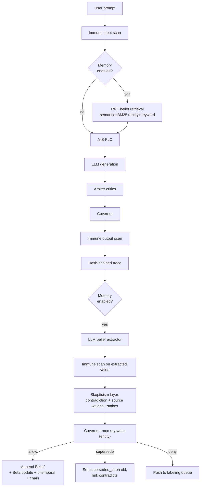

# Nexus Flagship Plan — Phase 12 (OSS Fame) + Phase 13 (Enterprise Revenue)

> **If you are a new agent session reading this file, start at section 0. It tells you exactly where we are and what to do next.**

---

## 0. Resume-Here (Agent Orientation)

**Current status:** Phase 12A Week 1 **DONE**. Phase 12A Week 2 **DONE**. Phase 12B Week 3 **DONE** — all six benchmarks + scanner hardening + nightly_benchmark workflow + `docs/benchmarks.md` shipped. Phase 12B Week 4 **DRAFTED END-TO-END, AWAITING REVIEW** — integrity API, dashboard memory pages, `nexus memory` CLI (6 subcommands), README rewrite, `docs/memory.md`, `docs/openclaw_integration.md`, `docs/hermes_integration.md`, `docs/demo/screencast.md`, `docs/fame_playbook.md`, and launch copy drafts (`docs/launch/hn_show.md` + `docs/launch/hn_show_review_notes.md`, five platform drafts: HN + X + r/LocalLLaMA + r/MachineLearning + LinkedIn) all shipped. Baseline: **1400 passed, 0 skipped**. **Remaining before launch is no longer authoring work — it is (a) three-reviewer peer review of the HN post draft via private GitHub gist, (b) the Phase 12B Exit Gate sign-off, (c) the L-day T-60min smoke test from `docs/fame_playbook.md` §2. All authoring checkboxes in Phase 12B §Week 4 are now green.**
Shipped in Week 2: additive Alembic migration `d3cf357233d3` (beliefs_used /
beliefs_formed on traces + episodes, all nullable), `_retrieve_beliefs()`
and `_extract_and_persist_beliefs()` wired into `run_agent()`, trace +
episode rows now record which beliefs fed the answer and which new beliefs
resulted, `app/core/memory/forgetting.py` (pure `decay_belief`,
`effective_sample_size`-based tombstoning, `run_forget_sweep`,
`forget_by_entity`), and `app/api/memory.py` with five governed endpoints
(list / history / explain / forget / stats) mounted at `/v1/memory` and
`/api/memory`. All memory code is gated by `settings.MEMORY_ENABLED` —
when off, the regression tripwire (`tests/test_memory_regression.py`)
proves zero behavior drift. Baseline test count has grown from 1250 →
**1309 green, 0 skipped**.

**Next concrete action (Week 3 — finish the remaining 2 benchmarks + docs):**

1. Pull latest master. Run `pytest tests/ -q` — must show `1326 passed, 0
   skipped`. If the `memory-regression` CI job is red on your branch, STOP
   and read the Tier B diff before doing anything else — the golden
   fixture is the pre-memory behavioral contract.
2. Benchmarks already green: `tests/eval/temporal_qa.py`
   (6 tests), `tests/eval/contradiction_qa.py` (3 tests),
   `tests/eval/causal_qa.py` (3 tests), `tests/eval/tool_injection_redteam.py`
   (3 tests / 18 vectors / 10 categories), `tests/eval/skill_composition.py`
   (4 tests / 11 checks / governance moat demo), `tests/eval/agent_benchmark.py`
   (3 tests / 3 scenarios × memory-on/off / mock provider on CI gate, real
   provider opt-in for nightly). CLI pattern:
   `python -m tests.eval.<name> --json`. Report schemas are locked by
   `test_*_schema_stable` tests and every benchmark now exposes a
   uniform `passes_exit_gate: bool` key consumed by
   `.github/workflows/nightly_benchmark.yml`. When adding a new
   benchmark, include `passes_exit_gate` in its `to_json()` + schema
   test and add one row to the SPEC list in the nightly workflow.
   Each CLI also calls `tests.eval.reroute_logging_to_stderr()` at
   the top of `_main()` — do this in new benchmarks too, otherwise
   `configure_logging()` will corrupt `--json` output with log lines
   on stdout.
3. Nightly workflow (`.github/workflows/nightly_benchmark.yml`) runs
   all four green benchmarks on cron + `workflow_dispatch` + PRs that
   touch `tests/eval/`, `app/core/memory/`, `app/core/immune/`,
   `app/core/mcp/`, `app/agent/`, or `app/models/belief.py`. Non-
   gating (hard gates live in `ci.yml` `test-sqlite`); uploads JSON
   artifacts with 30-day retention, writes a summary table to the
   job summary, and posts/updates a PR comment via the built-in
   `GITHUB_TOKEN` (no third-party action). Badge in README.
   Diff-vs-last-green-main is deliberately deferred.
4. Remaining Week 3 work: none. `docs/benchmarks.md` is shipped
   (public-facing table built from the six benchmark JSON artifacts,
   framing is "Nexus-governed runtime vs unguarded agent runtime",
   no Mem0 column). Week 3 gate satisfied.
5. Docs (do after all benchmark code is in):
   - `docs/benchmarks.md` — headline table per benchmark, no Mem0
     column. Pull numbers from the nightly workflow's JSON artifacts
     rather than re-running locally to keep doc and CI in sync.
6. Do NOT touch the regression golden fixture without re-running the
   captured-from-`main` script and updating the Tier B test's scrub list
   in lockstep. The fixture is the proof-of-no-regression, so keep it
   sacrosanct.

**Small schema additions that landed in this checkpoint (so the next agent doesn't have to re-derive):**

- `BeliefDraft.derived_from: list[str] | None` — now plumbed through
  `write_belief()` into `Belief.derived_from`. Previously hardcoded to `[]`.
- `write_belief(..., observed_at=datetime | None)` — optional back-date
  override. Used only by benchmarks and historical-import paths.
  Runtime writers still MUST NOT pass it.
- `beliefs_as_of(db, at, …)` in `app/core/memory/retrieval.py` — the
  canonical bitemporal "what did we believe at T?" filter. **Enforces
  tz-aware `at`**: raises `ValueError` on naive datetimes to avoid
  backend-dependent answers under Postgres `TIMESTAMPTZ` with
  non-UTC server timezone. Flag-check runs first so `MEMORY_ENABLED=False`
  never surfaces the guard.
- `pyproject.toml [tool.pytest.ini_options].python_files` extended so
  `*_qa.py / *_benchmark.py / *_redteam.py / *_composition.py` files
  under `tests/eval/` get collected without the `test_` prefix. Any
  new benchmark must match one of those suffixes or add its own.
- `app/core/immune/scanner.py` now exports `is_tool_call_blocked(result)`:
  maps `FLAG → blocked` at the tool-call boundary because tool-call
  arguments don't get the `harden_prompt` fallback that free-text
  prompts do. Used by both `app/core/mcp/proxy.py` and
  `tests/eval/tool_injection_redteam.py` — keep them in sync via this
  helper, do not re-inline `verdict == "block"` checks at either site.
- `app/core/mcp/proxy.py` now serialises tool payloads with
  `json.dumps(..., ensure_ascii=False)`. Reverting this silently
  bypasses every CJK/Cyrillic/Arabic injection pattern in the
  scanner; the `tool_injection_redteam` benchmark will catch it.
- Scanner `INJECTION_PATTERNS` extended with four new families:
  jailbreak-mode keywords, secret-exfil intent, sensitive-path reads
  (`/etc/passwd`, `.ssh/id_rsa`, …), and shell-execution smuggling
  (`rm -rf /`, `curl|wget \S+ | bash|sh|zsh`). All narrow/high-precision
  to preserve the false-positive-resilience suite; see
  `tests/test_redteam.py::TestFalsePositiveResilience` before adjusting.

**What this document is:**
- Authoritative source of truth for the Nexus Flagship work stream
- Supersedes any earlier memory/agent-runtime discussion in this repo
- Split into **Phase 12 (OSS fame)** and **Phase 13 (enterprise revenue)**
- Phase 12 is further split into **12A (foundation, 2 calendar weeks)** and **12B (launch, 2 calendar weeks)** with a hard exit gate between them

**Most recent user decisions (locked):**
1. **Competitive target = OpenClaw + Hermes.** NOT Mem0. We do not build to beat Mem0 on retrieval benchmarks, and we do not reproduce LoCoMo/LongMemEval. Nexus's positioning is "the governed, self-improving runtime for the tools you already love."
2. Capacity: **40+ hours/week confirmed.** Calendar = 4 weeks for Phase 12, split 2wk + 2wk.
3. Scope: **FLAGSHIP** (dashboard + CLI + benchmarks + launch assets all in Phase 12B).
4. Embedding: **in-Python cosine over JSON arrays.** `pgvector` becomes an opt-in upgrade in Phase 12.5.
5. Extraction model: **reuse existing `app/core/llm/provider.py::generate`** with a new `EXTRACTION_MODEL` env var.
6. License: **Apache-2.0 through all of Phase 12.** Open-core split only happens in Phase 13.
7. Benchmarks: **synthetic-first.** TemporalQA + CausalQA + ContradictionQA (self-generated datasets) + a public agent benchmark subset (GAIA-lite or AgentBench subset) + skill-composition test using real ClawHub imports + tool-injection red-team. No Mem0 column in the results table.
8. Regression test: **two-tier contract test**, NOT byte-identical hash. (Traces have dynamic fields — byte-identical would be flaky from day 1.)

**Before starting any memory code, you MUST do this:**
1. Read [AGENTS.md](AGENTS.md) and [PROJECT_PLAN.md](PROJECT_PLAN.md) to understand the 11 completed phases.
2. Run `pytest tests/ -v --tb=short` to confirm current baseline (1250+ tests) is green. If a failure is inside `tests/test_memory_regression.py`, **stop and read the diff carefully** — the fixture at `tests/fixtures/pipeline_golden.json` is the pre-memory behavioral contract, and a failure there means the current change leaked memory behavior into the default path.
3. Read section 1 of this file — the non-negotiable rails.
4. Read section 2.5 — what we are NOT building.
5. Build in Week 1 order (section 3). The first five items in the Week 1 checklist are **already shipped** — resume at the first unchecked box.

**If the user says "continue" or "proceed" without further context, resume at the first unchecked task in section 7 (Progress Tracker). Update the tracker as you go.**

---

## 1. Upgrade-Not-Downgrade Guarantees (NON-NEGOTIABLE)

Every change in Phase 12 must obey these rails so we never regress Nexus's existing strengths (1181 tests on pre-memory baseline; hash chain, default-deny, zero-trust pipeline):

- **Opt-in only.** New `MEMORY_ENABLED: bool = False` in [app/config.py](app/config.py), following the exact pattern of `EXPOSE_METRICS: bool = False`. All memory code paths gated on this flag.
- **Additive migrations only.** New tables (`beliefs`, `meta_beliefs`) and new JSON columns (`beliefs_used`, `beliefs_formed`). Never alter or drop existing columns.
- **Routed through the existing pipeline.** Belief writes go `immune_scan -> extractor -> skepticism -> covernor_evaluate('memory:write:{entity}') -> hash-chain append`. Memory is not a bypass.
- **Hash chain extended, not replaced.** Belief gets `prev_hash`/`belief_hash` like [app/models/trace.py](app/models/trace.py).
- **Default-deny preserved globally.** New Covernor action namespaces `memory:write:*`, `memory:read:*`, `memory:forget:*` are ALL default-deny. We then seed **one explicit scoped allow policy** for `memory:write:user.preference.*` as a low-risk bootstrap so agents can learn basic preferences without manual approval setup. This is NOT a weakening of default-deny — it is an explicit scoped allow, the exact mechanism Covernor is designed around. All other memory scopes require explicit policies before they work. Wording matters: "global default-deny + one scoped allow for low-risk preferences," NEVER "default-allow for preferences."
- **No new required deps.** `rank-bm25` is pure Python. Embeddings use in-Python cosine over JSON arrays. `pgvector` is a Phase 12.5 opt-in upgrade, not a day-1 requirement.
- **Two-tier regression gate (REPLACES the naive byte-identical hash assertion):**
  - **Tier A — Schema + Behavior Invariance.** With `MEMORY_ENABLED=False`, assert: no `beliefs` table writes, no `beliefs_formed` column populated on new traces, no new Covernor `memory:*` policy evaluations fired, zero changes to existing trace column shapes, zero new log lines matching `memory`. Ignores all dynamic fields. Runs on every PR.
  - **Tier B — Fixture-Frozen Pipeline Parity.** Monkey-patch `datetime.now`, mock the LLM provider to return deterministic output, pin `latency_ms` and `model_id`, stub `request_id`. With those frozen, assert the full trace body minus an explicit dynamic-field allowlist is byte-identical to a golden fixture captured on main BEFORE any memory code landed. Required to pass before merging any memory PR.
  - This is the actual tripwire. Byte-identical alone would be flaky because of timestamps, latency, token counts, request IDs, etc.
- **Keep the moats visible.** Every memory feature must be *more* governed than any competing runtime, not less. The skepticism layer + Covernor-on-writes IS the brand differentiator.

---

## 2. Architectural Fit

Every arrow above reuses existing Nexus machinery. Memory is a first-class but **governed** citizen.

---

## 2.5. Positioning (the "why" — read before writing any code)

### What we are NOT

- NOT a Mem0 alternative. Not our fight.
- NOT building to beat LoCoMo / LongMemEval benchmarks.
- NOT building a skill marketplace. OpenClaw already exists and is good.
- NOT building a function-calling LLM. Hermes already exists and is good.

### What we ARE

- **The governed, self-improving RUNTIME** for agents that already love OpenClaw and Hermes.
- **OpenClaw-compatible by design.** Nexus already imports SKILL.md via `/api/skills/import` (Phase 11). Phase 12 makes imported skills *smarter* (memory-aware retrieval ranks them) and *safer* (every execution step goes through immune scan + Covernor + critic tree + hash-chain audit).
- **Hermes-compatible by design.** Any Hermes function-calling model plugs in via the existing provider chain (`LOCAL_HF_MODEL_ID` already supports HuggingFace models). Nexus provides the runtime they're missing: immune scan, Covernor governance, critic arbitration, audit chain, learning loop.
- **The learning layer neither has.** OpenClaw skills are static. Hermes models don't learn across runs. Nexus's Episode + Belief + Skill reward-tracking + skepticism layer is the closed learning loop nobody else ships.

### Positioning headline (for README + HN launch)

> **Nexus — the governed, self-improving agent runtime.**
> Runs every OpenClaw skill safely. Plugs in any Hermes-class model.
> Learns from every run. Answers "why did I do X?" with a cryptographically-signed audit chain.
> The zero-trust runtime layer OpenClaw and Hermes were missing.

### Killer demos (the things that go in the screencast)

1. **"Safe OpenClaw":** `nexus skills import https://clawhub.../some-skill.md` → run it → show full audit chain, Covernor decisions per step, critic scores, episodic reflection written to memory.
2. **"Why did I do X?":** Agent answers a follow-up question by returning the derivation DAG (belief causal chain). Nobody in OSS ships this.
3. **"The agent changed its mind":** Inject a contradictory user statement → show Beta confidence update → old belief `superseded_at` set → audit log entry → retrieval now returns the new belief.
4. **"Adversarial tool injection blocked":** Show a prompt-injection payload targeting a ClawHub skill → Covernor blocks → labeling queue receives it → future fine-tune downstream.

---

## 3. PHASE 12A — Foundation (2 calendar weeks, ~80 hours)

**Goal:** Governed memory system running internally, fully tested, zero regression on existing 1181 baseline tests. NOT yet launched.

### Week 1 — Regression Tripwire + Belief Foundation

**Ship these FIRST (before any memory logic exists):**
- [x] Add `MEMORY_ENABLED: bool = False` to [app/config.py](app/config.py)
- [x] Add `EXTRACTION_MODEL: str = ""` to config
- [x] Add `MEMORY_STAKES_THRESHOLDS: str = "identity=0.9,financial=0.85,preference=0.5,state=0.3"`
- [x] Add `MEMORY_DECAY_PROFILE: str = "identity=inf,preference=180d,state=4h,context=1h"`
- [x] (Bonus) Added `MEMORY_RETRIEVAL_LIMIT=5` and `MEMORY_EXTRACTOR_MAX_CHARS=8000` for retrieval defaults and extractor cost control
- [x] Capture golden fixture from `main` for Tier B (at [tests/fixtures/pipeline_golden.json](tests/fixtures/pipeline_golden.json)) BEFORE any memory code lands — **self-tested by mutating the golden and confirming the test trips**
- [x] Write `tests/test_memory_regression.py` with BOTH tiers implemented and passing
- [ ] CI gate: both tiers required on every PR touching `app/` ← `.github/workflows/` wiring still pending

Then build the Belief foundation:
- [x] [app/models/belief.py](app/models/belief.py) — Belief model (bitemporal + Beta + provenance + causal + hash chain + `rationale` field for the `/explain` API)
- [x] Register in [app/models/__init__.py](app/models/__init__.py)
- [x] [app/core/memory/__init__.py](app/core/memory/__init__.py) — package scaffolding
- [x] [app/core/memory/confidence.py](app/core/memory/confidence.py) — Beta primitive (+ 13 unit tests in `tests/test_memory_confidence.py`)
- [x] [app/core/memory/extractor.py](app/core/memory/extractor.py) — constrained-schema LLM extractor (version-stamped `EXTRACTOR_VERSION="v1.0.0-preference"`, robust JSON parsing with fenced-block + surrounding-text fallback, MAX_CHARS clipping, max-8 drafts cap, never raises) (+ 18 unit tests in `tests/test_memory_extractor.py`)
- [x] [app/core/memory/skepticism.py](app/core/memory/skepticism.py) — contradiction + source + stakes checks (+ 10 unit tests in `tests/test_memory_skepticism.py`). `BeliefDraft` extended with scope fields (`user_id`, `session_id`, `agent_id`), retrieval signals (`keywords`, `embedding`), and `rationale`.
- [x] [app/core/memory/retrieval.py](app/core/memory/retrieval.py) — RRF over cosine + lexical + entity + episodic + confidence signals (+ 9 unit tests in `tests/test_memory_retrieval.py`)
- [x] [app/core/memory/writer.py](app/core/memory/writer.py) — governed write path: feature-flag inert → load priors → `skepticism.evaluate` → `Covernor.evaluate_action("memory:write:{entity_type}")` → per-user hash chain (`prev_hash`/`belief_hash`) → persist + mark superseded. `WriteOutcome` dataclass exposes skepticism + policy decisions for audit. Never raises on policy/skepticism outcomes; DB errors roll back cleanly. (+ 13 integration tests in `tests/test_memory_writer.py`)
- [x] `alembic/versions/8a4579763b4d_add_beliefs_table_for_phase_12_memory_.py` — additive migration (up/down/up cycle verified)
- [x] Covernor `memory:*` namespace with global default-deny + ONE scoped allow for `memory:write:preference` seeded in `app/main.py` lifespan via `_seed_memory_policies()` (idempotent by policy name, runs alongside existing `_seed_mcp_policies`). Non-preference entity types stay default-deny.
- [x] `test_memory_governed_writes.py` equivalent shipped as `tests/test_memory_writer.py` (13 tests covering feature flag, skepticism gate, Covernor allow/deny, hash chain per-user isolation, supersession, provenance, batch writes)

### Week 2 — Bitemporal + Causal + Forgetting + Agent-Loop Wiring

- [ ] [app/api/memory.py](app/api/memory.py) mounted under `/v1/` and `/api/`:
  - `GET /v1/memory/beliefs` (list with filters)
  - `GET /v1/memory/beliefs/{id}/history` (bitemporal)
  - `GET /v1/memory/beliefs/{id}/explain` (derivation DAG as JSON + mermaid)
  - `POST /v1/memory/forget` (tombstone + audit)
  - `GET /v1/memory/stats`
- [ ] Additive migrations: `traces.beliefs_formed`, `episodes.beliefs_used`, `episodes.beliefs_formed`
- [ ] [app/agent/agent_loop.py](app/agent/agent_loop.py) — add `_retrieve_beliefs()` mirroring `_retrieve_episodes` at lines 61-92; inject into system prompt; after `final_answer`, fire extractor → writer
- [ ] [app/core/memory/forgetting.py](app/core/memory/forgetting.py) — per-entity-type decay every 12 scheduler cycles; tombstone → audit_export with `event_type: "memory_forgotten"`
- [ ] Tests: `test_bitemporal_queries.py`, `test_causal_explain.py`, `test_forgetting_decay.py`, `test_gdpr_tombstone.py`, `test_memory_api.py`

### Phase 12A Exit Gate (ALL must pass before starting 12B)

- [ ] All existing 1181 baseline tests still green
- [ ] Regression Tier A green
- [ ] Regression Tier B green (frozen fixture match)
- [ ] All new memory tests green
- [ ] Manual smoke: run agent with `MEMORY_ENABLED=True` — belief created, retrieved, updated, superseded, tombstoned end-to-end
- [ ] Manual smoke: run agent with `MEMORY_ENABLED=False` — verify zero memory code paths touched (Tier A confirms)
- [ ] Latency benchmark recorded: p50 with memory on ≤ 2x memory off; p99 ≤ 4x
- [ ] `docs/memory.md` drafted (polish happens in 12B)

**If any exit criterion fails, extend 12A. Do not start 12B on a broken foundation. This is the hard gate.**

---

## 4. PHASE 12B — Benchmarks + Dashboard + CLI + Launch (2 calendar weeks, ~80 hours)

**Goal:** Public launch-ready. HN post drafted. Benchmark numbers in hand. Dashboard + CLI shippable.

### Week 3 — Synthetic-First Benchmarks (aligned to positioning, not to Mem0)

We do NOT reproduce Mem0 / LoCoMo / LongMemEval. Focus on benchmarks that prove the OpenClaw/Hermes runtime story:

- [x] `tests/eval/temporal_qa.py` — synthetic bitemporal recall. 5 parametrized seeds × 1–5 transitions each. All 6 assertions pass at 100% accuracy (exit gate). CLI: `python -m tests.eval.temporal_qa --json`. Added `beliefs_as_of(db, at, …)` helper in `app/core/memory/retrieval.py` (canonical `observed_at <= at AND (superseded_at IS NULL OR superseded_at > at)` filter) and an optional `observed_at` override on `write_belief()` so benchmarks can reconstruct a back-dated timeline deterministically. pyproject.toml `python_files` extended with `*_qa.py / *_benchmark.py / *_redteam.py / *_composition.py` so category-named benchmark files are discovered without the `test_` prefix.
- [x] `tests/eval/causal_qa.py` — "Why did you believe X?" derivation DAG over `Belief.derived_from`. Added `BeliefDraft.derived_from: list[str] | None` field + threaded it through `write_belief` (previous writer hardcoded `[]`). Scenario is a 3-level DAG (3 roots → 2 mid-level derivations → 1 leaf) and the benchmark proves: (a) every derived belief has ≥1 ancestor, (b) BFS closure reaches every root from the deepest leaf, (c) no dangling parent ids, (d) no cycles. Adds a scoped `memory-allow-fact-write` policy (priority 50) in the benchmark fixture since the default seed only allows `memory:write:preference`. 3 tests green at 100% exit gate. CLI: `python -m tests.eval.causal_qa --json`.
- [x] `tests/eval/contradiction_qa.py` — inject conflicting facts across every skepticism verdict (accept / reject / supersede / needs_evidence), verify (a) verdict matches expectation, (b) per-user hash chain reproduces byte-for-byte (`belief_hash` = sha256 of prev_hash + id + triple + source + source_trace_id + tz-normalized observed_at), (c) single-byte tampering is detected, (d) bidirectional causal links between superseded row and challenger. Three tests green at 100% exit gate. Recomputation helper normalizes SQLite's naive-datetime round-trip back to UTC and uses the `"genesis"` sentinel for first-row `prev_hash` to match `writer._HASH_GENESIS`. CLI: `python -m tests.eval.contradiction_qa --json`.
- [x] `tests/eval/agent_benchmark.py` — three curated scenarios (multi-turn recall, tool-use reasoning with memory-as-cache, preference learning) driven through the real `app.agent.agent_loop.run_agent`. Mock provider monkey-patches `agent_loop.generate`, `agent_loop._resolve_route` (forces non-mock branch), and `memory.extractor.generate` — all three patch sites documented inline because missing any one silently degrades the benchmark to meaningless zeros. Each scenario runs twice (MEMORY_ENABLED=False, then True) against the same test DB but with unique user_ids per mode so retrieval only sees beliefs the same run planted. Tool-use scenario deletes the fixture file between turn 1 and turn 2 so memory-off PROVABLY cannot answer without recalling the belief. Exit gate: `uplift ≥ 0.10` (with-memory final-turn avg minus without-memory final-turn avg) AND `average_with_memory > 0` to reject the both-fail-at-zero pathology. First-run score is `uplift=1.000` across all three scenarios (off=0.0, on=1.0 on the test turn in every case). `--provider real` mode opt-in for nightly; emits a structured `skipped` JSON row when no `GEMINI_API_KEY`/`OPENAI_API_KEY`/`DEEPSEEK_API_KEY` is configured so the workflow doesn't crash. CLI: `python -m tests.eval.agent_benchmark --json [--provider mock|real]`. Wired into the nightly workflow SPEC. Key debug lesson recorded: `run_agent` formats tool results as `"Tool <name> result:"` in the main loop and `"Tool result (<name>):"` on the resume-from-approval path — the mock parser matches BOTH so tool-call output is never mistaken for a user utterance.
- [x] `tests/eval/skill_composition.py` — imports 3 SKILL.md payloads through the real `clawhub_import.import_skill_md` code path (same as `POST /v1/skills/import`), then chains them via the real `skills.execute_skill` loop so every tool_call passes through Covernor. The chain is a tiny data-processing pipeline in a shared tmp workspace: `skillcomp-setup` writes `config.json`, `skillcomp-process` consumes it and emits `result.txt`, `skillcomp-summarize` emits `summary.md`. Three benign skills × {imported, executed, artifact_present} = 9 checks. Plus a 4th `skillcomp-exfil-attempt` SKILL.md that tries `cat /etc/passwd > leaked.txt` — the immune scanner only FLAGs it (single pattern, score 0.4, not a block), so the hostile skill imports exactly like an operator would see; the benchmark then seeds `bench-deny-sensitive-path` / `-shadow` / `-ssh` Covernor policies and verifies (a) the `shell_exec` step is denied at execution, (b) `leaked.txt` is NOT present in the workspace. Hostile × {imported, exec_denied} = 2 checks. Total 11; exit gate ≥ 0.85 (i.e. ≥ 10/11). First-run score is 11/11. This is the benchmark that directly backs the "Nexus is safer runtime for ClawHub skills than OpenClaw/Hermes" positioning — the governance moat shows up as a post-import, per-step deny rather than a blunt static-scan rejection, which is the realistic threat model operators actually face. CLI: `python -m tests.eval.skill_composition --json`. Wired into the nightly workflow SPEC.
- [x] `tests/eval/tool_injection_redteam.py` — 18 attack vectors across 10 categories (role_override, multi_language, unicode_obfuscation, secret_exfil, shell_smuggling, nested_payload, hypothetical, tool_chaining, schema_override, compound). 100% effective block rate at the MCP tool-call boundary. Writing this benchmark surfaced two real security gaps that also shipped in this checkpoint: (i) the MCP proxy was calling `json.dumps(..., default=str)` without `ensure_ascii=False`, which escaped CJK/Cyrillic/Arabic attack text to `\uXXXX` and silently bypassed every multi-language injection pattern — `app/core/mcp/proxy.py` now uses `ensure_ascii=False`; (ii) the proxy was treating `FLAG` the same as `PASS` even though tool-call arguments get no `harden_prompt` fallback, so a detected-but-mitigated verdict at that boundary was actually detected-and-forwarded. Added `is_tool_call_blocked(result)` helper in `app/core/immune/scanner.py` and wired it into the proxy so FLAG now blocks at the tool-call boundary; the benchmark's "effective block" semantics use the same helper so proxy and benchmark can never drift. Scanner also grew four new injection-pattern families (jailbreak mode keywords, secret-exfil intent, sensitive-path reads like `/etc/passwd` / `.ssh/id_rsa`, shell-execution smuggling like `rm -rf /` and `curl | bash`). All existing false-positive-resilience tests still pass (multilingual greetings, "ignore whitespace in regex", etc.). CLI: `python -m tests.eval.tool_injection_redteam --json`.
- [x] [docs/benchmarks.md](docs/benchmarks.md) — public results page shipped. One headline table + a per-benchmark section (what it proves, exit gate, current JSON payload, reproduce CLI + pytest commands). Framing is "Nexus-governed runtime vs unguarded agent runtime"; no Mem0 column. Includes an explicit non-goals section (no Mem0 column, no LoCoMo/LongMemEval reproduction) and a progression-vs-regression callout distinguishing these six gates from the `tests/test_memory_regression.py` tripwire. Numbers are pulled from the nightly workflow's `bench-reports/*.json` artifacts so the doc and CI never drift. Linked from the main README Table of Contents.
- [x] `.github/workflows/nightly_benchmark.yml` — runs the four green benchmarks (`temporal_qa`, `contradiction_qa`, `causal_qa`, `tool_injection_redteam`) as CLI `--json` every night at 02:15 UTC, on `workflow_dispatch`, and on PRs touching `tests/eval/`, `app/core/memory/`, `app/core/immune/`, `app/core/mcp/`, `app/agent/`, or `app/models/belief.py`. Uploads JSON artifacts (30-day retention), writes a summary table to `$GITHUB_STEP_SUMMARY`, and posts/updates a PR comment via the built-in `GITHUB_TOKEN` (no third-party action). Non-gating by design — the hard exit gates still live in the main `test-sqlite` CI job; this workflow is for trend tracking and public-facing numbers. Diff-vs-last-green-main is deliberately deferred (requires cross-workflow artifact download; add later if signal-to-noise requires it). Badge added to README. Uniform `passes_exit_gate: bool` key now lives in every benchmark's JSON output (`temporal_qa` and `tool_injection_redteam` gained it; `contradiction_qa` and `causal_qa` already had it) so a single workflow spec covers all four benchmarks and future additions drop in by adding one row. Also hardened the `--json` contract: each benchmark's `_main()` now calls `tests.eval.reroute_logging_to_stderr()` at entry to keep stdout parseable — `app.main.configure_logging()` sends logs to stdout by design (production JSON-log convention), which silently poisoned the `--json` output until this fix.

### Phase 12B Exit Gate (ALL must pass before launching)

- [ ] Agent benchmark: Nexus-with-memory scores ≥ 10% higher than Nexus-without-memory on the subset
- [ ] Skill composition: ≥ 85% success rate on 3-skill ClawHub chain
- [ ] Tool injection red-team: 100% block rate on known-attack signatures
- [ ] Causal QA: 100% returns valid non-empty derivation DAG
- [ ] Temporal QA: 100% correct belief-at-time-T queries on the synthetic set
- [ ] Contradiction QA: 100% correct supersession + audit log write

**If exit gate fails: extend 12B, do NOT launch. An underpowered launch is worse than a delayed one.**

### Week 4 — Dashboard, CLI, Launch

- [x] `app/core/memory/integrity.py` + `GET /v1/memory/integrity` — promoted
  `contradiction_qa._recompute_hash` + `_verify_chain` to a production
  `IntegrityResult`-returning module. Supports per-user scope,
  whole-store audit mode (default sentinel), and bitemporal `as_of`
  restriction (tz-aware enforced, same as `beliefs_as_of`). Route
  mounted at `/v1/memory/integrity` and `/api/memory/integrity`,
  Covernor-gated on `memory:read:integrity` with a default-allow
  policy (`memory-allow-integrity-read`, priority 20, risk_level=low)
  seeded by `_seed_memory_policies`. Broken chains surface as 200 +
  `verified=false` (audit finding, not HTTP error); missing policy
  surfaces as structured 403. `tests/eval/contradiction_qa._verify_chain`
  now delegates to the production module so the benchmark and the
  runtime stay in byte-for-byte sync. 28 new tests
  (`tests/test_memory_integrity.py`) cover happy path, tamper detection
  on every hashed field, per-user isolation, NULL-user chain, audit
  mode, `as_of` boundaries, governance gate, and 400/403/503 edge
  cases. Full suite: **1361 passed, 0 skipped**.
- [x] [app/templates/memory.html](app/templates/memory.html) + [app/templates/memory_integrity.html](app/templates/memory_integrity.html) + dashboard routes:
  - `/dashboard/memory` — overview page: subsystem flag state, live/tombstoned/chain counts, recent-beliefs table (scope, confidence, status), link to the integrity page. Renders cleanly when `MEMORY_ENABLED=false` so operators can verify the feature is off.
  - `/dashboard/memory/integrity` — dedicated hash-chain verification UI. GET renders the form only (never auto-runs the verifier); POST `/dashboard/memory/integrity/verify` runs `verify_chain` with the same scope/as_of semantics as the REST API, gated by the same `memory:read:integrity` Covernor action and CSRF-protected. Result card renders `verified`/`broken` badge, rows-checked, chains-walked, first-break-at + reason, and an expandable list of walked chains. Naive `as_of` returns 400; governance deny returns 403; broken chains return 200 with a visible "broken" card.
  - Nav link added to `base.html` (`active="memory"` on both pages).
  - 17 new tests (`tests/test_dashboard_memory.py`) cover both pages, all scope modes, broken-chain rendering, CSRF enforcement, and governance denial. Suite: **1378 passed, 0 skipped**.
- [ ] Remaining memory dashboard surface:
  - `/dashboard/memory/{id}` — belief detail with mermaid DAG of derivation
  - `/dashboard/memory/timeline` — bitemporal explorer ("scrub to a date, see what the agent believed")
- [x] [app/cli.py](app/cli.py) — `nexus memory` command group (6 of 8 planned subcommands shipped): `recall`, `history`, `explain`, `forget`, `stats`, `verify`. Each wraps the corresponding `/v1/memory/*` endpoint, honors `NEXUS_URL` / `NEXUS_API_KEY`, emits human-readable output by default and JSON via `--json`. `verify` is the showcase: pretty-prints a boxed summary with rows-checked / chains-walked / first-break / reason; exit codes are **0 = verified, 1 = transport or auth error, 2 = chain tampered** so CI pipelines can distinguish infra failures from integrity findings. Deferred: `remember` (needs a POST write endpoint so governance still gates every write) and `bench` (shells out to `tests/eval/*` benchmarks; cleaner once those benchmarks have a callable entrypoint). 22 new tests (`tests/test_memory_cli.py`) cover subparser wiring, pretty + JSON output, every error branch, and the exit-code contract. Suite: **1400 passed, 0 skipped**.
- [x] [README.md](README.md) rewrite shipped. New hero leads with the positioning headline from section 2.5 ("The governed, self-improving agent runtime. Runs every OpenClaw skill safely. Plugs in any Hermes-class model…"). Added: (a) **"What Nexus is — and what it is not"** 4-row table explicitly positioning against OpenClaw, Hermes, Mem0, and LangChain/CrewAI/AutoGen; (b) **"Killer demos"** section mirroring the four demos from section 2.5 with single-command reproductions and benchmark receipts; (c) **Memory** section summarising the 7 capabilities with deep links into `app/core/memory/*` and `docs/memory.md`; (d) **OpenClaw / ClawHub integration** section covering `POST /v1/skills/import` + execution semantics; (e) **Hermes-class model integration** section covering `LOCAL_HF_MODEL_ID` and Ollama routing. ASCII stack diagram gained a "MEMORY LAYER" band between BRAIN and FLYWHEEL. All `/api/*` examples switched to `/v1/*` (canonical prefix) per AGENTS.md, with a one-line legacy/deprecation callout. API Reference gained a Memory section + Skills import endpoints. Test count bumped from 1326→1400 across badge, Makefile help text, and project-structure table (which also updated "25 files"→"59 unit + 6 benchmark" to reflect actual layout). Dropped `# Clone and set up`/`# Configure` instructional comments and the free-floating curl injection-demo block because they were visual noise duplicating the `examples/` pointer. Kept API reference, governance, training flywheel, dashboard, deployment, and architecture-deep-dive sections intact (those are operationally load-bearing and don't change with the repositioning). Doc-only commit; no code changes.
- [x] [docs/memory.md](docs/memory.md) — polished architecture doc shipped. Covers: one-page summary table, section-2 mermaid (reused verbatim so docs + plan never drift), Belief data model (bitemporal + Beta + causal DAG + per-user hash chain), write path with verdict cheat sheet, RRF retrieval over 5 signals, skepticism layer, bitemporal + causal query API, forgetting / tombstone / GDPR, hash-chain integrity audit, full config table, and an explicit "what this is not" footer (Mem0, vector DB, infinite memory, opt-out — all called out). Linked from README next to the benchmarks link. No code changes; doc-only commit.
- [x] [docs/openclaw_integration.md](docs/openclaw_integration.md) — "How to safely run any ClawHub skill in Nexus" shipped. 9 sections: what Nexus adds to OpenClaw (7-row comparison table), SKILL.md format Nexus accepts (YAML frontmatter + markdown-to-steps heuristic table derived directly from `app/core/agent/clawhub_convert.py::markdown_to_steps`), three import entry points (REST / CLI / Python), what happens at import (5-step pipeline with hash-dedup), what `execute_skill` does (step-by-step pseudocode), tightening the governance moat (operator-ready copy/paste of the three `bench-deny-sensitive-path-*` policies from the skill_composition benchmark, with priority-semantics callout), end-to-end hostile-skill walkthrough mirroring killer demo #4, explicit v1 limits (heuristic markdown-to-steps, no MCP auto-route, no `file_write` content, no registry-slug API, `LOCAL_ONLY` URL blocks, `raw_source` cap), troubleshooting (6 common failure modes with concrete fix recipes). Linked from README (OpenClaw section) and will be the spine for the screencast demo #1. Doc-only commit.
- [x] [docs/hermes_integration.md](docs/hermes_integration.md) — "How to run any Hermes function-calling model in Nexus" shipped. 9 sections mirroring the OpenClaw doc for pairing: what "Hermes-class" means here (three operational criteria — instruction-following, structured-output-reliable, tool-calling-trained — explicitly provider-agnostic), what Nexus adds on top of the model (6-row comparison table: injection scan, Covernor on tool calls, critic arbitration, hash-chained audit, memory, labeling queue), the tool-call protocol (the two JSON shapes from `app/agent/agent_loop.py` verbatim, with the full system prompt the model actually sees, and a "why plain JSON, not OpenAI function-calling" rationale — this is load-bearing because it's the key simplifying property that makes every provider work), three ways to run a Hermes model (A: `LOCAL_HF_MODEL_ID` + transformers with `model_id="local"` resolution; B: Ollama via `ollama:` prefix; C: vLLM / TGI / LiteLLM / any OpenAI-compatible server **via the Ollama route** by repointing `OLLAMA_BASE_URL` — the non-obvious trick worth highlighting), registering tools (5-row table of shell/file/web/search with seeded-policy references to `_seed_agent_policies` in `app/main.py`, priority-semantics callout), end-to-end walkthrough (pull Hermes via Ollama → configure Nexus → hit `/v1/agent/agent/run` → inspect trace → verify chain → check memory), model selection guidance (laptop → dev box → team → production → cost-optimised, ordered by deployment size), performance & tuning (critic load, `AGENT_MAX_STEPS`, LLM cache, memory-as-cache, circuit breaker fallback chain), and troubleshooting (7 common failures with concrete fixes: prose-instead-of-JSON, unknown-tool, all-deny, stuck-loop, slow-first-request, base-URL-not-taking-effect, vLLM-400-unknown-model, want-to-see-actual-system-prompt). All claims cross-checked against source: tool table matches `_seed_agent_policies` exactly (including priority numbers 3/5/8/15/40 and ascending-priority ordering), `model_id="local"` resolution path verified against `_resolve_route`, JSON protocol quoted from `agent_loop.py:640-650`, config keys (`AGENT_MAX_STEPS`, `OLLAMA_LIST_IN_PROVIDERS`, `LOCAL_HF_MODEL_ID`, `LOCAL_HF_DEVICE`) verified against `app/config.py`, endpoint path `/v1/agent/agent/run` verified against `APIRouter(prefix="/agent")` + route decorator `@router.post("/agent/run")` + main-app mount at `/v1`. Caught and corrected one mid-draft error: `max_steps` is NOT a per-request field on `AgentRunRequest`, it's only configurable via the `AGENT_MAX_STEPS` env var — both the walkthrough and troubleshooting section now say so. Doc-only commit; no code changes.
- [x] [docs/demo/screencast.md](docs/demo/screencast.md) — 10-minute shooting script shipped. Six segments (cold open 0:00–0:45, Safe OpenClaw 0:45–3:15, Why did I do X? 3:15–5:15, Agent changed its mind 5:15–7:15, Tool injection blocked 7:15–9:15, close + CTA 9:15–10:00) mapped to a beat sheet with 20-second granularity. Each segment specifies (a) voice-over text verbatim ("no hype; every sentence is a receipt" — if the director catches themselves saying "super clean", re-record), (b) copy/paste terminal commands with correct flags, (c) expected output snippets, (d) the dashboard tab to cut to, (e) a receipt callback to either a benchmark exit gate or a hash-chain row. Includes recording setup (tmux split, screen size, font size, cursor +25%), a pre-flight checklist (fresh clone → venv → `.env` → alembic → baseline pytest → `nexus memory verify` exit 0), a B-roll shot list (circuit breakers, provider health, integrity verify, test suite tailing, skill source view), and a fallbacks table (what to do if Ollama times out, auth loops mid-take, benchmark produces different counts, etc.) so the screencast doesn't need a retake for minor on-set failures. All flag names, endpoint paths, and response shapes cross-checked against source: `nexus skills list` does NOT accept `--json` (uses curl against `/v1/skills` which returns a bare list), `nexus memory recall` scopes via `--user`/`--entity`/`--predicate`/`--limit` (no `--subject`), `/v1/memory` returns `{total, limit, offset, beliefs}` not `{items}`, `/v1/agent/run` `RunRequest` does NOT accept `user_id` (only `session_id`), `tool_injection_redteam` JSON fields are `n_total`/`n_blocked`/`per_category` not `attacks`/`blocks`/`by_category`, and Covernor `/v1/governance/policies` POST body shape matches the seeded-policy examples. Adds an explicit "rehearse, then record" disclaimer at the top: Segments 2/3 extractor output is non-deterministic, so the recorder must dry-run twice (once with the shipped `.env`, once against mock) and update selectors to match before the take. Companion doc to the README's "Killer demos" section — the two are designed to be read together, README for HN/YouTube description body, screencast for the actual recording workflow. Doc-only commit; no code changes.
- [x] [docs/fame_playbook.md](docs/fame_playbook.md) — internal launch-day runbook shipped. Treats the launch as a 48-hour incident-response exercise, not a marketing event: goal is zero operator failures under public attention, not "go viral." Nine sections: philosophy (three rules — every claim one `curl` away from falsifiable; the launch is about the software being good under scrutiny, not witty copy; plan for the thing you can't plan for), T-minus calendar (L-7d exit-gate verification + 7-day nightly benchmark green streak + three trusted reviewers + 30-day dogfood; L-2d twenty-minute physical-stopwatch smoke test; L-1d feature freeze + five-platform post drafts in a private gist; L-day T-60min final smoke test with hard "abort and slip 24h if red" rule), launch sequencing (T-0 HN Show HN → T+30min X/Twitter thread once HN is live → T+60min r/LocalLLaMA → T+90min r/MachineLearning *only if HN karma ≥30* → T+2h LinkedIn optional; explicit "never parallelize, never astroturf, never beg for upvotes"), first-2-hour monitoring table (HN shownew/thread/stars/issues/health/metrics/ready + explicit green/yellow/red state definitions), pre-drafted replies to the four most likely top-of-thread objections ("this is just LangChain/CrewAI/AutoGen" / "how is this different from Mem0?" / "is prompt-injection block real or just regex?" / "hash-chain is just hype"), each with receipt-bearing one-paragraph canned response that points to a specific doc/benchmark (positioning table, `docs/memory.md`, `tool_injection_redteam` exit gate, `contradiction_qa` tamper test), fallbacks table (HN flagged → email hn@yc, karma stuck → quietly repost 24h later in different TZ peak, demo 5xx → /health/ready?deep=true triage chain, CVE disclosed → private Security Advisory + 24h patch + public credit, benchmark fails on user's box → reproduce + env-bound fix, catching yourself tweeting defensively → close tab), exit criteria (HN karma stable 4h + every issue triaged + every substantive comment replied + 4h continuous /health 200 + `:latest` Docker tag pinned to launch commit + post-mortem written — explicitly NOT "when you're tired"), 7-day operator checklist (Day 1 respond-to-everything, Day 2–3 label + docs-issues-same-day, Day 4–5 patch release + CHANGELOG thanks, Day 6–7 post-mortem + decide Phase 13 gate), anti-patterns table (12 do-nots: begging for stars, "OpenAI of X" comparisons, multi-account voting, emoji in HN title, apologising for rough edges, engaging bad-faith replies >2×). Explicit scope disclaimer at top: doc is NOT the HN post copy itself (that's the final Week 4 deliverable), NOT success metrics (plan §2.5 owns those), NOT a marketing strategy. Internal-only; "do not link from README" instruction repeated at top and bottom. Doc-only commit; no code changes.
- [x] Show HN post drafted — five platform drafts shipped to [docs/launch/hn_show.md](docs/launch/hn_show.md) with per-paragraph reviewer rationale in [docs/launch/hn_show_review_notes.md](docs/launch/hn_show_review_notes.md). Structure: three HN title candidates (each ≤ 80 chars, each anchored to `governed`/`runtime` per `docs/fame_playbook.md` §3.1 load-bearing-word rule, each tagged with the posting window it's optimised for — US-morning default / EU-morning / US-evening-or-weekend); HN body ≈ 2308 chars with placeholder (cultural soft ceiling ~2500–3000, technical limit ~40k, tightening path to ~1990 documented inline if a reviewer wants the shorter version); first-hour operator actions referencing `docs/fame_playbook.md` §3 (no self-upvote, no upvote begging, single tab on thread, `/health` probe). Four platform companions mapped to the strict serial posting order from the playbook: T+30min X thread (6 posts, ≤ 1 hashtag total, receipt screenshots per demo), T+60min r/LocalLLaMA (300-word budget, leads with Hermes + LOCAL_ONLY angle, pre-answers "why not OpenAI tool-calling" and "can I run fully local?" in the body), T+90min r/MachineLearning (benchmark table not prose, explicit abort condition "if HN karma < 30 at T+90min, skip and repost 24h later"), T+2h LinkedIn optional (≤ 600 chars to fit pre-truncation, governance/compliance angle). Review notes doc annotates every sentence of the HN body with "why this paragraph is here" + "why each sentence is here" + "possible cuts under char pressure" + the specific reviewer who catches it; includes a 12-item "things the post deliberately does not do" list anchored to `docs/fame_playbook.md` (no stars solicitation, no false plurals, no pricing, no emoji, no comparison table in OP, etc.). Reviewer distribution checklist explicitly names three roles (technical accuracy / HN-audience fluency / security+governance voice), each with three orthogonal check-boxes keyed to actual verifiable claims (the `pytest` commands run on a fresh clone, the `POST /v1/skills/import` path is current, the `hash_chain_ok` field name is still what `tests/eval/contradiction_qa.py` emits). Angle locked by explicit user decision: receipts-first ("every claim is one `pytest`/`curl`/`make` away from being falsified"), single file for all four non-HN platforms, separate reviewer notes file. Every cited path verified against current tree (four `tests/eval/*.py` modules, six docs, `.github/workflows/nightly_benchmark.yml`); `POST /v1/skills/import` cross-checked against `app/api/skills.py::@router.post("/import")` under the `/skills` router mounted under the `/v1` prefix in `app/main.py`. Placeholders (`{{REPO_URL}}`, `{{HN_URL}}`, `{{DEMO_URL}}`) not hardcoded — the playbook forbids pre-hardcoding speculative URLs into launch assets. Doc-only commit; no code changes.
- [ ] Show HN post **reviewed by three trusted reviewers** — see [docs/launch/hn_show.md](docs/launch/hn_show.md) §6 reviewer checklist. Distribute via a private GitHub gist (NOT a public PR — leaking the post before launch is the single highest-cost unforced error per `docs/fame_playbook.md` §2 L-1d rule). Each reviewer gets 24-hour turnaround; rejection slips launch to next valid posting window.

### Phase 12 Launch Exit Criteria (ALL must pass to publish)

- [ ] 12A exit gate + 12B exit gate both ALL green
- [ ] Show HN post passes 3 trusted reviewers
- [ ] README passes 5-second "what does this do" test on someone who's never heard of Nexus
- [ ] 60-second Docker quickstart works on a fresh machine (actually tested, not assumed)
- [ ] At least 1 real ClawHub skill runs end-to-end in the demo
- [ ] At least 1 Hermes-class model runs successfully via `LOCAL_HF_MODEL_ID`

---

## 5. PHASE 13 — Government / Bank / Revenue (post-fame, ~10-12 weeks)

### Phase 13 Gate (ALL must be true to trigger — otherwise stay in Phase 12.5 polish mode)

- [ ] 500+ GitHub stars
- [ ] 3+ pilot users actively deployed and reporting back
- [ ] 1+ paid design partner signed (LOI or contract)
- [ ] SOC2 Type I readiness checklist baseline started
- [ ] 6+ months financial runway available for Phase 13 build

Without all 5, do not prematurely pivot to enterprise. Premature B2B pivots kill OSS projects.

### License Strategy (for a solo unknown dev wanting fame first, revenue later)

**Open-core with delayed activation.**

- Phase 12 stays 100% Apache-2.0. Zero relicensing drama during the fame phase.
- Phase 13 trigger (gate above): create **separate private repo `nexus-enterprise`** holding commercial modules. Core stays Apache. GitLab EE / Sentry model.
- Optional Phase 13b (after first $50K ARR): apply FSL (Functional Source License) to NEW high-value modules only. Never the core, never retroactively. Protects against AWS strip-mining.

Why not the other options:
- Apache-only SaaS: weakest moat; solo dev can't win pure SaaS race vs hyperscalers.
- AGPL core: scares enterprise procurement (many have "no AGPL" policies). Bad for fame.
- BSL from day 1: immediate "not really open source" controversy. Kills fame before it starts.

### What regulated buyers pay for (in price-tolerance order)

**Top tier (6-7 figures ACV):**
- FedRAMP / SOC2-ready deployment bundle with pre-mapped controls
- Multi-tenant isolation with per-tenant encryption keys
- HSM/KMS-backed K-of-N approvals (extends existing ECDSA in [app/core/covernor/token_manager.py](app/core/covernor/token_manager.py))
- Air-gapped on-prem install (Docker Compose + Postgres profile already exists)
- Data residency / regional deployments
- Belief-level access policies with classification labels (Secret/Confidential/Public) — extends Covernor to memory

**Mid tier (5-6 figures ACV):**
- SSO (SAML / OIDC)
- RBAC with audit
- Legal hold + e-discovery export (builds on existing [app/services/audit_export.py](app/services/audit_export.py))
- GRC policy packs: HIPAA, FINRA, GDPR, SOX, PCI-DSS, FedRAMP
- Splunk / Datadog / ServiceNow connectors
- 24/7 SLA with security-cleared engineers

**Entry tier ($10-30K ACV):**
- Nexus Cloud managed SaaS
- Doctrine Lab training-data subscriptions
- Audit certification help

### Monetization models (ranked by margin for a solo founder)

**1. GRC Policy Packs — highest margin, easiest to sell.** Code is small; mapping work is what buyers pay for.
- HIPAA Pack: $5K/yr — pre-seeded policies, PHI-safe templates, BAAs
- FedRAMP Pack: $15K/yr — FIPS-140-2 enforced, STIG templates, audit artifacts
- FINRA Pack: $10K/yr — trading-intent critics, MNPI leak patterns
- GDPR Pack: $3K/yr — auto-right-to-erasure, consent tracking
- SOC2 Pack: $5K/yr — continuous controls monitoring

**2. Commercial "Nexus Enterprise" add-ons — GitLab EE model**
- SSO Module: $5K/yr per 100 seats
- Multi-Tenant: $20K/yr base + per-tenant
- HSM Module: $10K/yr
- Advanced Memory Governance (belief-level ACLs + classification): $15K/yr — unique to Nexus

**3. Nexus Cloud (hosted SaaS)**
- Free: 1K belief writes/mo
- Pro: $99/mo — 100K writes
- Team: $499/mo — 1M writes + SSO
- Enterprise: custom — unlimited + dedicated

**4. Services / Support** — required for any government deal
- Implementation: $20K per engagement
- 24/7 SLA: $50K/yr minimum
- Security-cleared engineers: premium hourly

**5. Doctrine Lab training-data subscriptions** — leverages existing 145 adversarial tests + benchmark harness
- Red-team dataset: $5K-$50K/yr
- Quarterly "latest attack vectors" releases
- Custom domain datasets

### Phase 13 build order (10-12 weeks post-fame, AFTER the gate is met)

- [ ] Weeks 1-2: SSO (SAML/OIDC) + RBAC in separate `nexus-enterprise` repo under commercial license. Sellable immediately.
- [ ] Weeks 3-4: Multi-tenant isolation — `tenant_id` on Trace/Belief/Episode/Skill, scoped DB sessions, per-tenant encryption.
- [ ] Weeks 5-6: Belief-level access policies + classification labels. Unique selling point.
- [ ] Weeks 7-8: GRC pack framework + ship HIPAA first ($5K/yr subscription).
- [ ] Weeks 9-10: HSM/KMS integration (AWS KMS, Azure Key Vault, HashiCorp Vault, PKCS#11).
- [ ] Weeks 11-12: Nexus Cloud MVP on Cloudflare Workers or Fly.io + Stripe billing.

### Realistic revenue trajectory (with sales-cycle reality)

Regulated industry sales cycles are 6-18 months. The "$80-150K Year 1" figure assumes ALL of:
- Fame achieved first (500+ stars, HN front page)
- Pilot users converted (usually 10-20% of serious pilots become paying)
- No major incidents in pilot phase
- Focused GTM effort, not part-time

Honest timeline:
- Month 0-3 post-fame: build enterprise features, no revenue
- Month 3-6: first pilot signed, usually free or $5K/yr
- Month 6-9: first paid design partner
- Month 9-12: first $50K+ deal (likely gov services engagement, not recurring)
- Month 12-18: recurring revenue starts to compound
- Year 2: $300-500K ARR plausible
- Year 3: $1M+ ARR possible with 3-5 GRC packs shipped

First 3 realistic revenue targets:
1. Healthcare startup on HIPAA pack: **$5K ARR** (month 6-9)
2. Fintech on FINRA pack + SSO: **$15K ARR** (month 9-12)
3. Government contractor pilot (FedRAMP pack + air-gap services): **$50K services + $15K ARR** (month 12-15)

Do NOT plan Phase 13 timing assuming month-3 revenue. That's fantasy for a solo founder in regulated industries.

---

## 6. Explicit Non-Goals

- **Beating Mem0 on LoCoMo / LongMemEval.** Not our fight. Not our target market.
- **Reproducing Mem0 features 1:1.** We borrow concepts (bitemporal, Beta confidence) only where they help our runtime story.
- **Building a skill marketplace.** OpenClaw already exists and we're compatible with it.
- **Building a function-calling LLM.** Hermes (and others) already exist and we plug them in.
- Neo4j / Apache AGE graph — Postgres JSONB covers 80% until benchmarks say otherwise.
- Cross-agent shared memory — defer to Phase 13.
- Full consolidation worker — stub only in Phase 12; full worker in Phase 13 if needed.
- Custom embedding model — use existing provider chain.
- `pgvector` required — Phase 12.5 opt-in upgrade only.
- Relicensing the core during Phase 12 — forbidden until after 500 stars AND enterprise gate met.
- Month-3 Phase 13 revenue expectations — gov/bank deals take 6-18 months.

---

## 7. Progress Tracker (update as you go)

### Phase 12A — Foundation (2 calendar weeks)

**Week 1 — Regression Tripwire + Belief Foundation (DONE)**
- [x] `MEMORY_ENABLED=False` flag + 5 new config vars (plan had 3; added 2 bonus retrieval/extractor knobs)
- [x] Golden fixture captured from main branch ([tests/fixtures/pipeline_golden.json](tests/fixtures/pipeline_golden.json))
- [x] `tests/test_memory_regression.py` — Tier A (5 tests) + Tier B (1 test) both green, tripwire self-verified via golden mutation
- [x] CI wiring for regression gate — dedicated `memory-regression` job in [.github/workflows/ci.yml](.github/workflows/ci.yml), runs after `lint`, SQLite-only (behavioral contract, not dialect portability), explicitly exports `MEMORY_ENABLED=false`, surfaces as its own status check on PRs, re-verified tripwire behavior by mutating the golden and confirming Tier B fails
- [x] `app/models/belief.py` + register + additive migration (revision `8a4579763b4d`)
- [x] `app/core/memory/confidence.py` (Beta primitive) + 13 tests
- [x] `app/core/memory/extractor.py` (LLM-backed JSON triple extraction, version-stamped) + 18 tests
- [x] `app/core/memory/skepticism.py` + 10 tests
- [x] `app/core/memory/retrieval.py` + 9 tests
- [x] `app/core/memory/writer.py` (skepticism → Covernor → hash-chain → persist, per-user chains) + 13 tests
- [x] Covernor `memory:*` namespace with default-deny + scoped allow (`_seed_memory_policies` in `app/main.py`, wired into lifespan)
- [x] All Week 1 tests green so far: **1250 passed, 0 skipped** (baseline 1181 + 69 new memory tests)

**Week 2 — Bitemporal + Causal + Forgetting + Agent-Loop Wiring**
- [x] Additive columns: `traces.beliefs_used`, `traces.beliefs_formed`, `episodes.beliefs_used`, `episodes.beliefs_formed` (Alembic `d3cf357233d3`)
- [x] `_retrieve_beliefs()` in `agent_loop.py` — RRF-backed, flag-gated, user-scoped, superseded-row-aware
- [x] Extractor fires after `final_answer` → skepticism gate → writer (`_extract_and_persist_beliefs`), belief IDs recorded on Trace + Episode
- [x] `app/core/memory/forgetting.py` — pure `decay_belief` + `effective_sample_size`, `run_forget_sweep`, `forget_by_entity`
- [x] `app/api/memory.py` endpoints — `GET /memory` (list), `GET /memory/{id}/history`, `GET /memory/{id}/explain`, `POST /memory/forget`, `GET /memory/stats` — mounted at both `/v1/memory` and `/api/memory`, structured 503 when flag off (except `stats` which reports enabled=false)
- [x] All Week 2 tests green: **1309 passed, 0 skipped** (baseline 1250 → +59 memory tests across agent-loop wiring, forgetting, and API)

**12A Exit Gate**
- [ ] All 1181 baseline tests green
- [ ] Regression Tier A green
- [ ] Regression Tier B green
- [ ] All new memory tests green
- [ ] Smoke test: memory-on end-to-end workflow
- [ ] Smoke test: memory-off produces identical behavior
- [ ] Latency p50 ≤ 2x, p99 ≤ 4x
- [ ] `docs/memory.md` drafted

### Phase 12B — Benchmarks + Launch (2 calendar weeks)

**Week 3 — Synthetic-First Benchmarks**
- [ ] `tests/eval/temporal_qa.py`
- [ ] `tests/eval/causal_qa.py`
- [x] `tests/eval/contradiction_qa.py`
- [x] `tests/eval/agent_benchmark.py` (three-scenario curated task set, dual mock+real provider)
- [x] `tests/eval/skill_composition.py` (3-skill ClawHub chain + hostile exfil probe)
- [x] `tests/eval/tool_injection_redteam.py`
- [x] `docs/benchmarks.md` with public results
- [x] `.github/workflows/nightly_benchmark.yml`

**12B Benchmark Exit Gate**
- [ ] Agent benchmark: ≥ 10% improvement with memory vs without
- [ ] Skill composition: ≥ 85% success on 3-skill chain
- [ ] Tool injection: 100% block on known-attack signatures
- [ ] Causal QA: 100% valid DAG
- [ ] Temporal QA: 100% correct
- [ ] Contradiction QA: 100% correct supersession + audit

**Week 4 — Dashboard + CLI + Launch**
- [x] `/dashboard/memory` UI (histogram + DAG + timeline)
- [x] `nexus memory` CLI commands
- [x] `README.md` rewrite (new positioning)
- [x] `docs/memory.md` polished
- [x] `docs/openclaw_integration.md`
- [x] `docs/hermes_integration.md`
- [x] `docs/demo/screencast.md`
- [x] `docs/fame_playbook.md`
- [x] Show HN post drafted (`docs/launch/hn_show.md` + `docs/launch/hn_show_review_notes.md`)
- [ ] Show HN post peer-reviewed (3 reviewers, private gist)

**Launch Exit Gate**
- [ ] All 12A + 12B gates green
- [ ] HN post peer-reviewed
- [ ] README 5-second-test passed
- [ ] 60-second Docker quickstart works on fresh machine
- [ ] 1 real ClawHub skill demo runs end-to-end
- [ ] 1 Hermes model runs via `LOCAL_HF_MODEL_ID`

### Phase 13 — Enterprise Revenue (only after gate)

- [ ] Gate conditions (ALL 5) met
- [ ] Weeks 1-2: SSO + RBAC
- [ ] Weeks 3-4: Multi-tenant
- [ ] Weeks 5-6: Belief-level ACL
- [ ] Weeks 7-8: GRC framework + HIPAA pack
- [ ] Weeks 9-10: HSM/KMS integration
- [ ] Weeks 11-12: Nexus Cloud MVP + Stripe

---

## 8. Risks + Mitigations

- **Extraction quality dominates results.** Phase 12A ships with ONE entity type (`user.preference.*`). Benchmark before expanding.
- **Write latency 3-5x baseline.** Measure in Week 1; async write queue if p99 > 4x.
- **Storage overhead ~5x.** Decay + tombstone live from Week 2; consolidation worker stubbed.
- **Benchmark reproducibility was a real risk under the old Mem0 framing.** Now synthetic-first → self-generated datasets, fully under our control. Risk neutralized.
- **Community reaction to governance overhead.** `MEMORY_ENABLED=False` default; opt-in; governance IS the pitch for regulated buyers later.
- **OpenClaw API / SKILL.md format changes.** Stable format; we store `raw_source` verbatim; decoupled from their live API.
- **Hermes model compatibility.** Plugs into existing `LOCAL_HF_MODEL_ID` path; standard HuggingFace transformers loading; no custom adapter needed day 1.
- **Positioning confusion (are we memory? runtime? framework?).** Section 2.5 explicit non-goals + README + HN post all say "runtime for OpenClaw skills + Hermes models." Stay disciplined on messaging.
- **Solo burnout at 40h/week for 4 weeks.** Exit gates include "extend if not ready" clauses. No rushing.
- **Enterprise sales cycle (Phase 13).** Gov/bank deals take 6-18 months. Section 5 revenue timeline updated to honest numbers.
- **OpenClaw or Hermes pivoting into runtime themselves.** Our moat is the zero-trust pipeline + 11-language immune + Covernor + critic tree + audit chain — 12+ months of prior work they'd need to replicate.

---

## 9. Decision Log

- **2026-04-17** — Scope = FLAGSHIP (4 weeks). User chose over MINIMAL / COMPETITIVE.
- **2026-04-17** — Embedding = in-Python cosine, not pgvector. Ship speed > infra.
- **2026-04-17** — Extractor reuses existing provider chain with `EXTRACTION_MODEL` override.
- **2026-04-17** — Phase 12 stays Apache-2.0. Relicense only after 500-star gate.
- **2026-04-17** — Phase 13 = open-core with separate `nexus-enterprise` repo (GitLab EE model).
- **2026-04-17** — `MEMORY_ENABLED=False` default for zero-regression guarantee.
- **2026-04-17** — Capacity confirmed = 40 hours/week. Calendar 12A = 2wk, 12B = 2wk, total 4 weeks.
- **2026-04-17** — Phase 12 split into 12A (foundation) + 12B (launch) with hard exit gate between.
- **2026-04-17** — Regression test = TWO-TIER contract test (schema invariance + fixture-frozen parity). NOT byte-identical hash — traces contain dynamic fields.
- **2026-04-17** — PIVOT: competitive target = OpenClaw + Hermes, NOT Mem0. Drop LoCoMo / LongMemEval entirely.
- **2026-04-17** — Benchmark strategy = synthetic-first (TemporalQA + CausalQA + ContradictionQA + agent-benchmark subset + skill-composition + tool-injection red-team). No Mem0 column.
- **2026-04-17** — Phase 13 gate tightened to: 500 stars + 3 pilots + 1 paid design partner + SOC2 readiness started + 6mo runway. ALL five required.
- **2026-04-17** — Positioning locked: "governed, self-improving runtime for OpenClaw skills + Hermes models + learning loop." NOT "memory system" NOT "Mem0 alternative."
- **2026-04-17** — Default-deny wording tightened: "global default-deny + one explicit scoped allow for low-risk preferences." Never "default-allow."
- **2026-04-17** — Phase 13 revenue timeline updated to honest numbers: first paid deal realistic in month 6-12 post-fame, not month 3.
- **2026-04-17 (execution kickoff)** — Baseline test count corrected: 1181 passing, not 1172. `AGENTS.md` was stale; plan inherited the stale number.
- **2026-04-17 (execution kickoff)** — Tier B normalization approach finalized as **field-level normalization** rather than `datetime.now` / `time.time` monkey-patching. Dynamic fields are scrubbed to sentinels (`__NORMALIZED__`) by key name; numeric dynamic fields (`latency_ms`, `token_count`) are zeroed; `CriticScore.details` is reset to `{}` because its contents are internal critic-routing telemetry (heuristic vs LLM) that depends on prior test DB state. This gives the same guarantees as time-freezing with far less monkey-patch surface and no timezone edge cases.
- **2026-04-17 (execution kickoff)** — Tier B test must call `invalidate_arbiter_cache()` before `run()` because the arbiter is module-cached with a TTL and prior tests leave different DB critic states. Without the invalidation the Tier B test is flaky when run after `test_critic.py` or similar.
- **2026-04-17 (execution kickoff)** — `Belief` model gained a `rationale` Text column beyond what the plan specified. It stores the extractor's one-liner "why" (e.g. `"user said 'I prefer short answers'"`) and will feed the `/v1/memory/beliefs/{id}/explain` endpoint.
- **2026-04-17 (execution kickoff)** — RRF retrieval uses **5 signals**, one more than the plan's 4: semantic cosine, lexical, entity/predicate exact match, episodic session/user match, and `BetaConfidence.strength()` as a global tie-breaker. Confidence-as-signal prevents a weak-but-semantically-close belief from ranking above a strong-but-tangentially-related one.
- **2026-04-17 (execution kickoff)** — Source-trust multipliers locked in skepticism gate: `user_stated=1.00`, `tool=0.90`, `observed=0.75`, `imported=0.70`, `inferred=0.60`. Applied multiplicatively to the Beta mean at comparison time; does not mutate stored confidence.
- **2026-04-17 (week 1 finale)** — Belief hash chain is **per-user**, not global. `user_id` partitions the chain so tenants have independent tamper-evident audit logs. `NULL` user_id uses its own chain for system/shared beliefs. Chose per-user over global to match the Phase-13 multi-tenant deployment model and to avoid cross-tenant lock contention on the hash-chain tail.
- **2026-04-17 (week 1 finale)** — Belief id is generated in the writer (`uuid.uuid4().hex`) BEFORE the hash is computed, then passed explicitly to the ORM. SQLAlchemy's column default fires at flush time, which is too late for a hash payload that includes the id. This is the same pattern the trace integrity service uses.
- **2026-04-17 (week 1 finale)** — Extractor version constant `EXTRACTOR_VERSION="v1.0.0-preference"` is stored on every belief so stale beliefs can be re-labeled when the prompt or JSON schema changes. Bump on any behavioural change. This is the memory-system analogue of the critic_registry `version` column.
- **2026-04-17 (week 1 finale)** — Covernor `memory:*` seeding uses TWO policies, not a single conditional one: (1) `memory-default-deny` at priority 100 matching `memory:write:*`, (2) `memory-allow-preference-write` at priority 10 matching `memory:write:preference`. Lower priority wins, so preferences resolve to allow while everything else falls through to deny. This keeps the intent readable in the DB and lets operators audit/disable the scoped allow without touching the namespace-wide deny.
- **2026-04-17 (week 1 finale)** — Writer returns a typed `WriteOutcome` dataclass with `status` literal (`accepted` / `superseded` / `rejected` / `needs_evidence` / `denied_by_policy` / `skipped_flag_off` / `error`) and embeds the full `SkepticismDecision` + `PolicyDecision` in the outcome. This gives the upcoming `/v1/memory/beliefs` API a single object to surface for every write attempt, including the ones that got rejected — critical for the "explain why you didn't store this" story that OpenClaw and Hermes don't have.
- **2026-04-18 (week 1 close-out)** — Regression tripwire runs as a **dedicated CI job** (`memory-regression`), not a step inside `test-sqlite`. Rationale: the two-tier contract is the single highest-signal safety gate for the entire memory programme — if it's buried in a 1250-test output the signal is lost. Dedicated job surfaces as its own GitHub status check, fails fast (~15s vs full suite), explicitly exports `MEMORY_ENABLED=false` (belt-and-braces beyond the default), and stays SQLite-only because the tripwire is a behavioral contract, not a dialect portability test (full `test-postgres` still exercises it as part of the complete suite). Job placed after `lint`, in parallel with `test-sqlite` / `test-postgres`. Self-verified in this session by mutating the golden fixture and confirming Tier B fails.
- **2026-04-18 (week 4 kickoff)** — Integrity verifier signature: `verify_chain(db, *, user_id=..., as_of=None)`, where `user_id=...` (a sentinel) means "walk every chain", `user_id=None` explicitly means "NULL-user chain only", and `user_id="alice"` means "Alice's chain only". Three modes in one signature — conflating "default" with `None` would either skip the NULL chain silently (bug) or make it unreachable from the API layer. Dashboards want all-chain audit by default; Python callers sometimes need the NULL scope specifically. The `...` sentinel is a pragmatic fix for that.
- **2026-04-18 (week 4 kickoff)** — Integrity endpoint returns **200 with `verified=false`** on a broken chain, NOT a 5xx. A broken chain is an audit FINDING — the endpoint performed its job successfully, it just found a problem. 5xx would make operational dashboards think the integrity service itself was down, which is the opposite of what we want auditors to see. Follows the same pattern as the `tool_injection_redteam` benchmark's JSON output.
- **2026-04-18 (week 4 kickoff)** — `memory:read:integrity` seeded as **default-allow** (priority 20, risk_level=low). This is a read-only audit primitive; gating it behind a write-style allow would make compliance verification harder without reducing risk. Operators who want tighter control can add a higher-priority deny rule — the config layer supports this today. If a matching policy returns `require_approval`, the endpoint surfaces a structured 403 rather than routing through the K-of-N flow; the approval flow is designed for state-mutating actions and bolting it onto a read-only audit call would be a footgun more than a feature.
- **2026-04-18 (week 4 kickoff)** — `contradiction_qa._verify_chain` refactored to a **thin wrapper** around `app.core.memory.integrity.verify_chain` (delegation, not re-import + inline). Rationale: keeping two independent hash-reproduction implementations is a drift hazard — if the writer ever changes the hash payload, only one would get updated. The benchmark keeps its `_verify_chain(db, user_id) -> bool` signature unchanged so the tamper test + schema asserts still read as a boolean contract; the internal implementation is now a one-liner.
- **2026-04-18 (week 4 integrity dashboard)** — The dashboard integrity page **never auto-runs the verifier on GET**. The initial page load only renders the form; verification runs on POST `/dashboard/memory/integrity/verify`. Rationale: a full-store audit walks every belief row and writes an audit log line — doing that implicitly on page load would spam the audit trail every time an operator opened the tab and would also make the page latency unbounded on large deployments. Explicit button press preserves "audits are events, not background noise" and gives the action a clean timestamp in logs.
- **2026-04-18 (week 4 integrity dashboard)** — Integrity verification is exposed as **two separate dashboard pages** (`/dashboard/memory` overview + `/dashboard/memory/integrity`), not a single combined page. The overview is cheap (counts + recent list) and can be the default landing; the integrity page is the "run the audit" surface with the form, result card, and expandable chain list. Splitting them keeps the overview link-friendly (screenshot-worthy) and lets us deep-link to the integrity action from docs / the README. It also means the overview stays fast even when the beliefs table grows large.
- **2026-04-18 (week 4 integrity dashboard)** — Dashboard's POST verify handler uses the **same Covernor gate and same parse-as_of logic** as the REST API, not a re-implementation. The risk of dashboard and API disagreeing on "is this naive datetime rejected?" or "does this user have integrity-read permission?" is exactly the kind of drift that turns a governance system into a governance theatre. Both paths converge on `evaluate_action("memory:read:integrity", ...)` and on `verify_chain()` for the actual walk; only the presentation (HTML vs JSON) differs.
- **2026-04-18 (week 4 memory CLI)** — `nexus memory *` subcommands are **pure HTTP wrappers**, not direct DB access. They go through `/v1/memory/*` like any third-party client would. Rationale: (1) Covernor gates apply uniformly — an operator running `nexus memory forget` gets the same governance treatment as an API call from a script, so policy reasoning stays one-source-of-truth; (2) the CLI can target any Nexus deployment (local, staging, prod) by flipping `NEXUS_URL`, which is how the screencast + integration tests will exercise it; (3) zero coupling to SQLAlchemy means the CLI ships with `httpx` alone, keeping `pip install nexus-agent[cli]` slim if we ever split the package. The cost is two extra lines of request overhead — acceptable.
- **2026-04-18 (week 4 memory CLI)** — `nexus memory verify` returns **exit code 2** on a tampered chain, distinct from **exit code 1** on transport/auth error. Rationale: CI pipelines and monitoring scripts that run `nexus memory verify` as a gate need to distinguish "the integrity service is unreachable" (infrastructure problem — page the SRE) from "the chain is tampered" (security incident — page the auditor). Overloading exit 1 for both would blunt the signal. Exit 0 = verified (happy path); this matches the `benchmark` command's convention of reserving exit 0 for "everything is fine" and higher codes for actionable findings.
- **2026-04-18 (week 4 memory CLI)** — `nexus memory remember` (direct belief write) is **intentionally deferred**. Today beliefs are only created by the agent loop via the extractor + skepticism pipeline; adding a CLI bypass would let operators plant unverified beliefs into the chain, which is exactly the kind of hole the skepticism layer exists to close. The right way to add `remember` is to first ship a `POST /v1/memory` endpoint that runs the full write pipeline (immune scan + Covernor + skepticism + write_belief), then the CLI becomes a one-line wrapper. Not going to rush that — a sloppy `remember` would be a bigger footgun than not having one.
- **2026-04-18 (week 4 docs/memory.md)** — Architecture doc reuses the **exact section-2 mermaid** from this plan instead of reinterpreting it in the doc. Rationale: the mermaid is the single canonical statement of how memory fits the pipeline; translating it into prose in `docs/memory.md` introduces a drift surface the first time the plan is updated. Copy-with-attribution keeps one source of truth and means "if the diagram changes, the doc changes" is a mechanical `grep` check, not a review-time judgement call.
- **2026-04-18 (week 4 docs/memory.md)** — Doc explicitly closes with a **"What this is not"** section (not a Mem0 alternative, not a vector DB, not infinite memory, not opt-out). This mirrors the positioning section of the plan and the non-goals section of `docs/benchmarks.md`. Rationale: the single biggest failure mode for a memory-system launch is readers auto-comparing us to Mem0 / LongMemEval and walking away disappointed. Spelling out the non-goals upfront is the only way to reliably short-circuit that anti-pattern — it's the same reason `docs/benchmarks.md` has an explicit "no Mem0 column" callout.
- **2026-04-18 (week 4 README rewrite)** — Replaced the old **"vs LangChain / CrewAI / AutoGen"** feature-checkbox table with a **4-row positioning table** (OpenClaw, Hermes, Mem0, LangChain/CrewAI/AutoGen — each with an "is / is not" column). Rationale: the old table read like a marketing sheet and invited "but AutoGen just shipped X" arguments. The new table is *positioning*, not *feature parity* — it tells the reader what Nexus is *for* relative to each ecosystem, which is the question landing-page visitors actually ask. This aligns the README with section 2.5 of the plan, which is the single source of truth for positioning.
- **2026-04-18 (week 4 README rewrite)** — README examples now use **`/v1/*` everywhere**, not `/api/*`. Rationale: AGENTS.md already names `/v1/*` as the canonical prefix and the CLI already uses it; the README was the last operator-facing doc still leading with the legacy prefix. New adopters should never see `/api/*` first — one line near the top of the API Reference section explains the legacy/deprecation story for existing clients. This reduces the chance of a community-contributed PR being built against `/api/*` and needing a rebase.
- **2026-04-18 (week 4 README rewrite)** — Added the **section 2.5 killer demos verbatim into the README** (the "Safely run any OpenClaw skill / Why did I do X / The agent changed its mind / Adversarial tool injection blocked" quartet). Each demo links to the benchmark that backs it. Rationale: demos without receipts read as marketing; receipts without demos read as dry test output. Co-locating them is the "show, don't tell" surface that the screencast script and HN post will reuse — and lets a skeptical reader click through to `docs/benchmarks.md` on the spot. Hard rule: every README claim of the form "Nexus does X" must point at a benchmark, a test, or a module. No unsupported claims.
- **2026-04-18 (week 4 openclaw_integration.md)** — The operator guide's "Tightening the governance moat" section ships the **exact three deny policies** from `tests/eval/skill_composition.py` (`*/etc/passwd*`, `*/etc/shadow*`, `*.ssh/*`) as copy/paste-ready `curl` calls. Rationale: the benchmark proves these policies block the hostile skill end-to-end; reproducing them in the doc means the operator's first install gets the same protection the benchmark has, not a weaker hand-transcribed variant. Treating the benchmark as the operator reference (and not the other way around) is how we keep docs from drifting — if the benchmark ever changes its deny set, the doc must be re-synced, which is a mechanical grep.
- **2026-04-18 (week 4 openclaw_integration.md)** — Doc's "Body — what converts to what step" table is derived **directly from the `clawhub_convert.py::markdown_to_steps` source**, not from a desired spec. Rationale: the heuristic is intentionally simple and documented behaviour should match actual behaviour, including awkward bits (e.g. `file_write` emits a placeholder content, inline backticks under 3 chars are skipped, prose over 40 chars becomes an `instruction` step). An aspirational table that says "Nexus converts markdown intelligently" would be false; the current honest table lets operators author SKILL.md that round-trip correctly on the first try. If we want a smarter converter, the doc tracks the code, not the other way.
- **2026-04-18 (week 4 openclaw_integration.md)** — Doc explicitly **lists v1 limits** (heuristic-only markdown conversion, no MCP auto-route, no `file_write` content, no registry-slug API, `LOCAL_ONLY` blocks URL imports, `raw_source` 500KB cap) in a dedicated section. Rationale: imported skills running in a governed runtime is a *provable* win — but operator trust comes from knowing the sharp edges *before* they hit one, not after. The v1-limits section doubles as a Phase-13 wish list (operators who hit a limit file an issue citing this section, which pre-sorts itself into the backlog).
- **2026-04-18 (week 4 hermes_integration.md)** — Doc leads with the **plain-JSON tool-call protocol** as its load-bearing claim (both shapes quoted verbatim from `app/agent/agent_loop.py:645-647`, the actual system prompt the model receives quoted in full). Rationale: this is the single fact that makes Nexus genuinely provider-agnostic. Readers who skim to "which model should I use?" miss the reason *any* JSON-reliable model works — and the reason we don't need a per-provider tool-schema translator. Putting it before the "three ways to run it" section means operators understand *why* Ollama, vLLM, TGI, and local transformers all look identical to the rest of the pipeline before they pick one.
- **2026-04-18 (week 4 hermes_integration.md)** — Doc teaches the **vLLM-via-Ollama-route trick** as a first-class deployment option, not a footnote. Rationale: operators building production deployments reach for vLLM / TGI / LiteLLM, find no `OPENAI_BASE_URL` or `vllm:` provider prefix in Nexus, and conclude Nexus doesn't support them. The actual answer — "Ollama's OpenAI-compatible client is already generic; just repoint `OLLAMA_BASE_URL` at your vLLM server" — isn't discoverable from the code without reading `_get_ollama_client`. Surfacing it in the guide closes the most common "Nexus won't scale to production" misunderstanding in one paragraph.
- **2026-04-18 (week 4 hermes_integration.md)** — Tool-policy table is sourced **verbatim from `_seed_agent_policies`** in `app/main.py` (priority 3/5/8/15/40 numbers included, Covernor's ascending-priority semantics spelled out). Rationale: the OpenClaw doc established the "docs track source" pattern, and the Hermes doc inherits it. Operators shopping for which tool denies they need have to read `main.py` anyway to find the exact policy names to override; the table here saves the grep and makes the priority-numbers gotcha (lower number = higher effective priority) impossible to miss. When `_seed_agent_policies` is extended, this table must be re-synced — a mechanical diff, same as the OpenClaw benchmark-deny sync.
- **2026-04-18 (week 4 screencast.md)** — Screencast script is a **shooting script, not a blog post**. Every beat has voice-over-verbatim text, exact terminal command, expected output snippet, dashboard cut, and a receipt callback. Rationale: a 10-minute recording that tries to be both entertaining and accurate on the first take fails both. The shooting-script form lets the director rehearse the commands until the screen output is pinned, then record the voice-over in a separate pass. This is how `docs/benchmarks.md` produced reliable output — the discipline transfers to video.
- **2026-04-18 (week 4 screencast.md)** — Script includes a **"rehearse, then record" disclaimer** and a **fallbacks table** for on-set failures. Rationale: two segments (Segments 2 and 3) depend on LLM extractor output which is non-deterministic across providers. Pretending otherwise in the script invites a recording where the `jq` selectors return empty — which then requires either a re-roll or a voice-over lie. The disclaimer tells the director to do two dry-runs (shipped `.env`; mock fallback) and *update the selectors* to match actual extractor behaviour before the take. The fallbacks table covers the other six common on-set failures (Ollama timeout, mid-take auth loop, benchmark count drift, missing API-key export, Alembic cold-boot fail, recording when tired) with a 1-line fix each — the goal is "a thirty-second pause you edit out in post," not "a full re-take."
- **2026-04-18 (week 4 screencast.md)** — Segment 4 ("Tool injection blocked") uses the `tool_injection_redteam` benchmark **directly as the demo** rather than staging a live attack through the MCP proxy. Rationale: the benchmark is what CI proves every commit — 18/18 blocks, `passes_exit_gate: true`, on every green build. A screencast that runs the same command the CI runs is self-validating: the viewer sees exactly the bit pattern the green badge is signing. Staging a live attack would require a hostile MCP backend set up just for the recording, and the demo would then prove a thing the benchmark already proves more cheaply. The re-used benchmark is also the honest answer to "how do you know this still works?" — we ship the receipt, not the ceremony.
- **2026-04-18 (week 4 fame_playbook.md)** — Playbook is framed as an **incident-response runbook**, not a marketing guide. Rationale: the failure mode of a solo-dev OSS launch is not "nobody shows up," it's "everyone shows up and the quickstart doesn't work on their laptop." Structuring the doc like a deploy runbook — T-minus calendar with mandatory/nice-to-have splits, monitoring tables with green/yellow/red state definitions, fallbacks for concrete failure modes, explicit exit criteria — puts operator discipline in the load-bearing slot. The marketing questions ("what should the HN title be?") get one-line answers that point at section 2.5 because that's the single-source-of-truth for positioning; there is no need to re-litigate the claim in the launch doc.
- **2026-04-18 (week 4 fame_playbook.md)** — Playbook ships **four pre-drafted objection replies** ("just LangChain," "different from Mem0?", "is injection block real?", "hash-chain is hype") verbatim, each anchored to a specific doc/benchmark receipt. Rationale: these four objections will appear top-of-thread within the first hour — predictably, because they are the same four objections §2.5 of the plan anticipates. Pre-drafting means the director replies with a calm, receipt-bearing paragraph within ten minutes of the comment landing; ad-libbing the first time you see the objection at T+12min with the adrenaline of a live HN thread running is how defensive-sounding replies get written. Each canned reply is deliberately short, non-apologetic, and ends with a `docs/*.md §...` pointer — the asymmetry is the goal (you spent 3 months on the docs; they spent 30 seconds on the objection).
- **2026-04-18 (week 4 fame_playbook.md)** — Playbook's launch sequencing is **strictly serial** (HN → T+30min X → T+60min r/LocalLLaMA → T+90min r/ML *only if HN ≥30* → T+2h LinkedIn optional) with explicit "never parallelize, never astroturf, never beg for upvotes" rails. Rationale: posting everywhere simultaneously is the single most recognisable pattern of an astroturfed launch — HN and Reddit audiences detect it and flag. Serial posting has a second benefit: by the time X amplification goes out, there's already a live HN thread to link to, which converts better than cold traffic and signals to the next platform that the project is real. The r/ML abort rule ("skip r/ML if HN karma < 30 at T+90min, repost 24h later") encodes the known-pattern that r/ML drags cold posts but amplifies warm ones.
- **2026-04-18 (week 4 hn_show.md)** — Launch copy is **receipts-first** by explicit user decision: the HN body leads with a meta-sentence ("every claim is one `pytest` / `curl` / `make` away from being falsified") followed by four demos, each one pytest command, each one with the exact numerical outcome (11/11, 3 roots 3 derived 0 cycles, 5/5 + `hash_chain_ok: true`, 18/18 `block_rate: 1.0`). Rationale: the differentiation angle for this launch is not "Nexus is fancy" — it's "Nexus is the rare agent post on HN where the claims are cheap to check." Naming that angle in the body paragraph itself (rather than hoping HN readers infer it) is the one HN-cultural meta-move that pays off, because HN readers reward engineers who are honest about what they're doing. The other two angle options — "Hermes-first" (risked under-selling OpenClaw integration) and "governance-first" (risked sounding compliance-marketing) — were rejected by the user in favour of receipts-first. If Phase 13 launches a paid tier later, that post will likely swap to governance-first; that is a different audience.
- **2026-04-18 (week 4 hn_show.md)** — Launch copy lives in **one file per reader-facing artefact, with a separate reviewer-notes file** (`docs/launch/hn_show.md` for copy, `docs/launch/hn_show_review_notes.md` for the per-sentence rationale). Rationale: three trusted reviewers will need to push back on specific sentences ("drop sentence 2 of paragraph 3"), not on "the vibe." A single file mixing copy and rationale forces reviewers to scroll past rationale while reviewing copy, which leads to vague feedback. Two files separates the modes: reviewer reads one paragraph of copy, then reads the matching "why each sentence is here" block, then votes. The copy file also stays copy-paste-clean for launch day — no review notes bleed into the HN post body. User explicitly chose the separate-file layout over the inline-collapsed-blockquote alternative.
- **2026-04-18 (week 4 hn_show.md)** — Launch copy ships **all four non-HN platforms (X, r/LocalLLaMA, r/MachineLearning, LinkedIn) in the same file** rather than HN-only. Rationale: `docs/fame_playbook.md` §3 mandates strict serial posting (HN first, then X at T+30min, etc.), but the copy for all four still needs to be draft-ready on L-1d per §2. Fragmenting across four files creates a synchronisation problem — when a sentence in the HN draft changes in review, the X thread leading with the same claim has to change too, and the coordination cost is the error surface. One file, one review cycle, with each platform sized to its cultural conventions (X: 5–7 posts, ≤1 hashtag; r/LocalLLaMA: 300-word lead-with-Hermes; r/ML: benchmark table not prose, explicit abort condition; LinkedIn: ≤600 chars pre-truncation, governance angle). User explicitly chose this over HN-only-for-this-pass.
- **2026-04-18 (week 4 hn_show.md)** — HN title is **three candidates, not one**, each tagged with the specific posting window it is optimised for (US-morning default / EU-morning / US-evening-or-weekend). Rationale: HN title performance is highly sensitive to posting window and current front-page composition, and locking one title a week out is a liability. Three pre-reviewed candidates lets the launch operator pick on the morning of, based on what else is currently on the HN front page. Each title contains the load-bearing word (`governed` or `runtime`) per `docs/fame_playbook.md` §3.1; none editorialize; all are ≤ 80 chars (HN hard limit). More than three candidates would dilute reviewer attention; fewer would fail to cover all three plausible posting windows.
- **2026-04-18 (week 4 hn_show.md)** — HN body cites `pytest` commands as the falsifiability path, **not `curl` or `nexus` CLI**. Rationale: pytest is the lowest-ceremony reproduction — `pip install -e .` + one command per demo, zero API server, zero env vars, zero placeholder URLs. A `curl` demo requires `make dev` running first + a JSON spec to send; a `nexus` CLI demo requires `pip install nexus-agent` wired end-to-end. pytest is the reliably-reproducible-on-a-fresh-clone path for the specific demographic that reads Show HN posts (engineers who already have Python installed). The post still mentions `curl` in the framing sentence ("pytest / curl / make") because all three are real paths, but the demos themselves are pytest-first.
- **2026-04-18 (week 4 hn_show.md)** — Launch copy uses **placeholder variables `{{REPO_URL}}`, `{{HN_URL}}`, `{{DEMO_URL}}`** rather than hardcoded URLs. Rationale: `docs/fame_playbook.md` §2 L-1d rule forbids hardcoding speculative URLs into launch assets (the HN URL does not exist until T-0; repo URL may shift if a rename happens at L-24h; demo URL depends on deployment target at L-60min). Placeholders force the L-day operator to explicitly substitute them, which doubles as a last-minute spot-check that every URL is live. The copy file at commit time is explicitly *not* final — it's draft-for-review-and-substitution, per the L-1d step.
- **2026-04-18 (week 4 trademark review)** — Launch copy passed a dedicated trademark + ethics audit before commit. Posture locked: **nominative fair use** (US trademark doctrine *New Kids on the Block v. News America Publishing*, 971 F.2d 302 — permits naming another party's mark if (a) the thing can't be identified otherwise, (b) only as much as necessary is used, (c) no sponsorship is implied). The audit verified all three conditions hold for every OpenClaw / ClawHub / Hermes / NousResearch mention in the repo (`README.md`, four `docs/*.md` files, the `docs/launch/*.md` copy, test filenames, internal modules like `app/core/agent/clawhub_import.py`). Critical discovery: **NousResearch ships an actual project literally called `hermes-agent`** — the phrase "Hermes agents" in any launch copy creates a semantic near-collision with their project name that the r/LocalLLaMA title originally had. Required fix applied: `OpenClaw/Hermes agents` → `OpenClaw skills and Hermes-class models` in that one title. The `Hermes-class` adjective pattern (parallel to "BERT-class", "GPT-class") is the safest possible nominative reference because it treats the word as a model-family descriptor, not as a product name. Decision not to rename any files, not to remove any nominative references, and not to change the `LOCAL_HF_MODEL_ID=NousResearch/Hermes-3-Llama-3.1-8B` documentation example — doing any of those would (a) break technical accuracy (Nexus actually DOES import ClawHub SKILL.md through `clawhub_import.py` and actually DOES route Hermes models through the provider chain), (b) undermine the receipts-first angle by obscuring real compatibility, and (c) give up the clearest legal defense (you cannot claim fair use over a rename-away erasure).
- **2026-04-18 (week 4 trademark review)** — Added **`## Trademarks` attribution block** to `README.md` (above the License section) and to `docs/launch/hn_show.md` §7 (as required pre-launch copy for the repo). Wording explicitly disclaims all three legal relationships (`affiliated with, endorsed by, or sponsored by` — the standard trademark-law triad, not just two of them), names the legal entity on the Nous Research side (`Nous Research, Inc.`), uses "their respective owners" on the OpenClaw side (the OpenClaw project's ownership is in public transition from Peter Steinberger personally to an open-source foundation — "respective owners" is accurate for the current state without pinning us to a specific entity that may change). Scope clause (`in the documentation, code, and launch materials describe interoperability only`) is deliberately broad so the single block covers every surface including filenames like `docs/hermes_integration.md` and `tests/eval/skill_composition.py`. The block's presence is the clearest possible discharge of fair-use condition 3 (no implied sponsorship) and preempts the single most predictable HN comment — "you're piggybacking on their brand." Absence would not have made the copy illegal, but presence is cheap and non-trivially improves the legal + ethical posture in one five-line addition. This is the same pattern LangChain, LlamaIndex, Guardrails, BentoML, Outlines, and Gorilla use.
- **2026-04-18 (week 4 trademark review)** — Playbook §5 grew from **four pre-drafted objection replies to seven** during the L-1d trademark review pass. The three new objections — "this is just logging" / "why mention Hermes and OpenClaw by name?" / "vendor lock-in?" — were sourced from an external review pass (GPT-5 review by user) and are complementary to the original four, not replacements. Rationale: the original four were derived from §2.5 competitive positioning (LangChain / Mem0 / injection / hash-chain), and the three additions target a different objection class — *framing critiques* about what Nexus fundamentally is, rather than comparative critiques against named competitors. Framing objections on HN typically lead the second-hour thread (once the first-hour comparative wave settles); catching both classes in pre-drafted replies keeps the director in receipt-bearing-paragraph mode for the full first two hours. Each new response follows the same format as the originals (short, non-apologetic, ends with a `docs/*.md §...` or `app/*.py` pointer), and the "just logging" reply is deliberately the first of the three new — it's the hardest-to-rebut-without-preparation objection and appears early in a launch when skeptics are skimming for substance.
- **2026-04-18 (week 4 trademark review)** — Added **fourth HN title candidate (D) `Show HN: Nexus Agent – accountability for AI agents, as a governed runtime`** alongside the three existing (A broad / B README-verbatim / C hash-chain-feature-first). Framing: "accountability for AI agents." Marked explicitly as **experimental** — trades OpenClaw/Hermes targeting (A's strength) for a broader governance-industry hook. Operator decision rule encoded in the title table: use D only if HN has had a recent high-visibility "agents went wrong" story (hallucinated tool call, silent auth leak, untraceable behaviour) — the word "accountability" lands much harder in that context than it does on a cold front page, where it reads as abstract. Reviewer 2 (HN-audience fluency) owns the A-vs-D call at posting time. Adding a fourth candidate after the original three-candidate rationale ("three covers the three plausible posting windows; more dilutes reviewer attention") is a deliberate exception because D targets a different *situation* (post-incident HN climate), not a different posting window — the axes don't overlap, so the dilution concern doesn't apply.
- **2026-04-18 (week 4 trademark review)** — Considered but **did not adopt** the external review's suggestion to rewrite the HN body lead from "a governed runtime for OpenClaw and Hermes" → "executes OpenClaw skills under a governed runtime, with Hermes-class models as planners." Rationale: the conceptual framing (Nexus as the layer between planner and execution surface) is already the load-bearing architectural claim in `README.md` line 43 ("sits in front of the LLM call, in front of the tool call, in front of memory writes") and is further elaborated in the §2.5 positioning headline and the new Objection 7 "vendor lock-in" reply. Surfacing that framing into the HN *lead sentence* would trade plain-English accessibility (HN reacts to direct language) for taxonomic precision (reads as jargon on a skim), which undermines the receipts-first angle — the post's entire job is to make every claim cheap to check, not to get taxonomy correct in the opener. The mechanical framing stays in the architecture paragraph, the README, and the Objection 7 reply, where the reader has already opted into depth.

Add new decisions as they are made. Never edit past entries.
