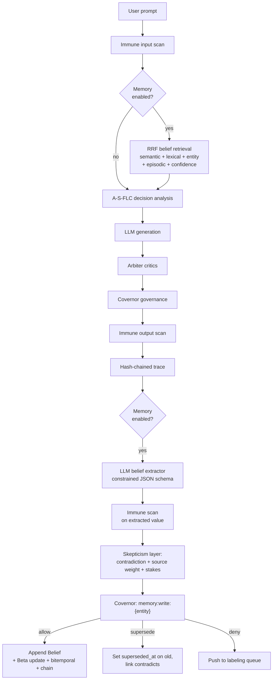

# Nexus Agent — Memory Architecture

> **Positioning.** Nexus is **not** a Mem0 alternative and **not** a
> standalone memory store. It is a **governed, self-improving agent
> runtime** — the layer that runs OpenClaw skills safely and plugs in
> any Hermes-class tool-calling model. This document describes how the
> memory subsystem fits into that runtime: what a belief is, how it is
> written and retrieved under the same zero-trust contract as every
> other Nexus surface, and what operators can rely on when they enable
> it.

All code references in this doc point at the real modules on `main`.
Line numbers are not pinned — follow the file path and grep for the
function name if you need to open the exact span.

---

## Contents

1. [One-page summary](#one-page-summary)
2. [Where memory sits in the pipeline](#where-memory-sits-in-the-pipeline)
3. [The Belief — data model](#the-belief--data-model)
4. [Write path — governed, auditable, bitemporal](#write-path--governed-auditable-bitemporal)
5. [Read path — RRF over five signals](#read-path--rrf-over-five-signals)
6. [Skepticism layer](#skepticism-layer)
7. [Bitemporal & causal queries](#bitemporal--causal-queries)
8. [Forgetting, tombstoning, GDPR](#forgetting-tombstoning-gdpr)
9. [Hash-chained integrity audit](#hash-chained-integrity-audit)
10. [Configuration](#configuration)
11. [What this is not](#what-this-is-not)

---

## One-page summary

| Concern | Answer |
|---|---|
| On/off switch | `MEMORY_ENABLED=False` by default. With the flag off, **zero** memory code paths execute (proven by `tests/test_memory_regression.py` Tier A). |
| Where a belief lives | A single row in the `beliefs` table. Bitemporal (`observed_at` / `superseded_at`), Beta-distributed confidence (`alpha` / `beta`), causal provenance (`derived_from`, `contradicts`), and a per-user tamper-evident hash chain. |
| How it is written | Extractor → immune scan → skepticism → Covernor → append + hash. Never raises on policy/skepticism outcomes — they surface as structured `WriteOutcome` records. |
| How it is retrieved | Reciprocal Rank Fusion over **five** signals: semantic (cosine), lexical (BM25-lite), entity overlap, episodic overlap, confidence. |
| How the agent uses it | `app/agent/agent_loop.py::_retrieve_beliefs` injects top-k into the system prompt. After `final_answer`, `extractor → writer` fires. |
| How you prove it works | Six nightly benchmarks in [docs/benchmarks.md](benchmarks.md) and an externalisable hash-chain verifier at `GET /v1/memory/integrity`. |
| How you see it | `/dashboard/memory` + `/dashboard/memory/integrity`, plus the `nexus memory` CLI. |

---

## Where memory sits in the pipeline

Memory is a first-class but **governed** citizen. Every read happens
*after* the immune input scan, and every write goes through the same
Covernor policy engine that gates tool calls and skill execution.



Nothing above is new infrastructure. Every arrow reuses an existing
Nexus primitive — immune scanner, Covernor policy engine, labeling
queue, hash chain, trace store. Memory is a *new type of event* on
top of machinery the runtime already has.

---

## The Belief — data model

The canonical schema lives in [`app/models/belief.py`](../app/models/belief.py).
A single row packs four distinct ideas that most memory systems handle
with separate tables (or, more often, not at all):

```text
┌─────────────────────── BELIEF ───────────────────────┐
│ id, user_id, session_id, agent_id                    │  ← scope
├──────────────────────────────────────────────────────┤
│ entity, predicate, value                             │  ← the triple
│ entity_type  (preference | fact | state | …)        │
├──────────────────────────────────────────────────────┤
│ observed_at, superseded_at                           │  ← bitemporal
├──────────────────────────────────────────────────────┤
│ confidence_alpha, confidence_beta  (Beta(α, β))      │  ← belief strength
├──────────────────────────────────────────────────────┤
│ source_type, source_trace_id                         │  ← provenance
│ derived_from [belief_id, …]   contradicts [id, …]    │  ← causal DAG
├──────────────────────────────────────────────────────┤
│ rationale   (human-readable "why I believe this")    │
│ keywords, embedding                                  │  ← retrieval signals
├──────────────────────────────────────────────────────┤
│ prev_hash, belief_hash                               │  ← tamper-evident chain
└──────────────────────────────────────────────────────┘
```

### Bitemporal

Every belief carries two clocks:

- `observed_at` — when the agent learned this fact (write time).
- `superseded_at` — when the agent stopped believing it (supersession time).

A belief is **live** at time `t` iff `observed_at <= t AND (superseded_at IS NULL OR superseded_at > t)`.
That single filter is what [`beliefs_as_of()`](../app/core/memory/retrieval.py)
uses and what the `temporal_qa` benchmark hammers end-to-end. No
"latest value" magic, no silent overwrite — the history is the table.

### Beta-distributed confidence

Instead of a flat confidence scalar, each belief carries
`confidence_alpha` and `confidence_beta` — the conjugate prior
parameters of a Beta distribution. Confirming evidence bumps `alpha`;
contradicting evidence bumps `beta`. The mean `α / (α + β)` is what
retrieval uses for the confidence signal, but the **distribution**
itself is what the skepticism layer uses to decide whether a new
contradictory observation is strong enough to supersede. See
[`app/core/memory/confidence.py`](../app/core/memory/confidence.py).

### Causal provenance

`derived_from: list[belief_id]` is the parent pointer in a DAG. Every
non-root belief cites the beliefs that produced it. `contradicts:
list[belief_id]` links supersessions bidirectionally. This is what
lets `/v1/memory/beliefs/{id}/explain` return "why did I believe X?"
as a real derivation DAG instead of a vibes explanation. The
`causal_qa` benchmark proves roots exist, every derived belief has
≥1 ancestor, closure walks every root, and there are no cycles.

### Per-user hash chain

`prev_hash` / `belief_hash` form a per-scope append-only chain:
`belief_hash = sha256(prev_hash || id || entity || predicate || value
|| source_type || source_trace_id || iso8601(observed_at in UTC))`.
The first row in a chain uses the sentinel `"genesis"` as its
`prev_hash`. Any single-byte tamper is detectable — see the
`contradiction_qa` benchmark for the byte-for-byte proof and
`GET /v1/memory/integrity` for the runtime verifier.

---

## Write path — governed, auditable, bitemporal

`app/core/memory/writer.py::write_belief` is the only sanctioned way a
belief gets into the table. The path is intentionally chatty so that
every decision is recordable:

```text
write_belief(db, draft, covernor, …)
 │
 │ 1. Feature flag  ──► MEMORY_ENABLED=False ⇒ return inert WriteOutcome
 │
 │ 2. Load priors   ──► existing (live) beliefs for (user, entity, predicate)
 │
 │ 3. Skepticism    ──► evaluate(draft, priors) → verdict ∈
 │                        {accept, supersede, reject, needs_evidence}
 │                     + reasons + confidence update plan
 │
 │ 4. Covernor      ──► evaluate_action(f"memory:write:{entity_type}",
 │                                        context={stakes, verdict, source})
 │                     default-deny; per-entity-type policies opt in.
 │
 │ 5. Apply         ──► on allow+accept    : append new row
 │                     on allow+supersede : set superseded_at on parent;
 │                                          new row links contradicts;
 │                                          Beta(α, β) updated per verdict
 │                     on deny            : no DB write; push labeling_queue
 │                     on reject          : no DB write; rationale recorded
 │
 │ 6. Hash chain    ──► prev_hash := last belief_hash in scope (or "genesis")
 │                     belief_hash computed, row persisted atomically
 │
 └─► WriteOutcome { verdict, policy_decision, belief_id?, reasons[] }
```

Key properties that fall out of this design:

- **Default-deny.** Without a scoped `memory:write:{entity_type}` policy,
  every write is denied. The `_seed_memory_policies()` lifespan hook in
  `app/main.py` seeds exactly one allow by default —
  `memory:write:preference` — and nothing else. Operators opt in to
  more. The `causal_qa` benchmark seeds its own
  `memory-allow-fact-write` policy in a fixture so the suite
  demonstrates the opt-in path.
- **Never raises on policy/skepticism outcomes.** A rejected or denied
  write is a *result*, not an exception. DB errors still roll back
  cleanly.
- **Per-user isolation.** The hash chain is scoped per `user_id` (and
  per-NULL for system-scoped beliefs). One user cannot tamper with
  another's chain without also breaking their own — verified by
  `contradiction_qa` and `tests/test_memory_integrity.py`.
- **Audit surface.** Every write appears in the regular Nexus trace
  stream, and every denial appears in the labeling queue with a
  structured reason, ready for the training flywheel.

### Write verdict cheat sheet

| Verdict | Meaning | DB effect |
|---|---|---|
| `accept` | New, non-conflicting belief | Append row |
| `supersede` | Priors exist but new evidence overrides them | Append new row; set `superseded_at` on prior; bidirectional `contradicts` link |
| `reject` | Weaker contradiction; priors stay | No write; rationale recorded |
| `needs_evidence` | Stakes high enough to require corroboration | No write; returned to caller |

---

## Read path — RRF over five signals

`app/core/memory/retrieval.py::retrieve` implements **Reciprocal Rank
Fusion** over five parallel rankers. RRF was picked over any
weighted-sum schema because it needs no per-signal calibration — each
ranker just has to emit an *order*, and the fusion combines orders
robustly regardless of absolute score magnitudes.

```text
query (user, session, entity filters, optional NL text, limit k)
  │
  ├── semantic rank  : cosine(query.embedding, belief.embedding)
  ├── lexical rank   : token-overlap over triple text (BM25-lite)
  ├── entity  rank   : exact / prefix match on entity + predicate
  ├── episodic rank  : co-occurrence with retrieved Episode rows
  └── confidence rank: Beta mean  α / (α + β)
  │
  ▼
RRF fuse with k=60, deduped on belief_id
  │
  ▼
top-k ScoredBelief [{belief, rrf_score, per-signal ranks}]
```

The five-signal mix is deliberate:

- **Semantic** handles paraphrase ("the user hates cilantro" ≈ "don't
  use coriander") but hallucinates distant neighbours on short text.
- **Lexical** anchors the retrieval to literal tokens and catches
  near-duplicates semantic cosine drops.
- **Entity** guarantees that a query *about a specific user/entity*
  actually returns beliefs *scoped to that entity*.
- **Episodic** carries the reflection signal — if a past episode used
  this belief, surface it again.
- **Confidence** is the tiebreaker: if two beliefs rank equally on
  content, prefer the one the agent actually believes.

`beliefs_as_of(db, at=…)` is the bitemporal read path — no RRF, just a
scoped SQL filter (`observed_at <= at AND (superseded_at IS NULL OR
superseded_at > at)`). This is the primitive every other memory
feature — explain, integrity, dashboard timeline — ultimately stands
on.

---

## Skepticism layer

`app/core/memory/skepticism.py` is what makes the memory system
**self-correcting** instead of a write-mostly append log. Every
incoming `BeliefDraft` is evaluated against its live priors along
three axes:

1. **Contradiction** — does the new value disagree with a live prior
   on the same (user, entity, predicate)?
2. **Source weight** — how much does the agent trust the *source* of
   this observation (`user_direct > tool_output > llm_inference >
   background_extraction`)?
3. **Stakes** — how expensive is it to be wrong? Driven by
   `MEMORY_STAKES_THRESHOLDS` (identity=0.9, financial=0.85,
   preference=0.5, state=0.3 by default). A high-stakes contradiction
   returns `needs_evidence` instead of a silent supersession.

The output is a verdict (see cheat sheet above) plus a Beta update
plan: `alpha += k` on confirmations, `beta += k` on contradictions,
with `k` scaled by source weight. This is the mechanism that makes
the "agent changed its mind" demo real — an old belief's
`superseded_at` is stamped *at the same time as* the new row lands,
and the audit log entry is written in the same DB transaction.

---

## Bitemporal & causal queries

The API shape mirrors how operators actually ask questions of a
memory store:

| Route | Answers |
|---|---|
| `GET /v1/memory` | "what do I believe right now about X?" (live beliefs, optionally include tombstoned) |
| `GET /v1/memory/{id}/history` | "how did this specific fact evolve over time?" |
| `GET /v1/memory/{id}/explain` | "why do I believe this?" — derivation DAG as JSON (+ rendered mermaid in the dashboard) |
| `GET /v1/memory/stats` | counts + confidence distribution |
| `POST /v1/memory/forget` | tombstone (see next section) |
| `GET /v1/memory/integrity` | hash-chain verifier (see section 9) |

Everything is mirrored under `/api/memory/*` for backward compatibility
and subject to the same auth / rate-limit / structured-error contract
as every other Nexus endpoint.

The CLI wrappers (`nexus memory recall / history / explain / forget /
stats / verify`) are **pure HTTP clients** over these endpoints — not
direct DB access. That is deliberate: the CLI can never bypass
Covernor, and operators can run it against a remote deployment
identically to a local one.

---

## Forgetting, tombstoning, GDPR

"Remember everything" is neither correct nor legal. Nexus exposes
three distinct forgetting mechanisms:

- **Supersession** — the soft forget. The belief is still in the
  table, still in the audit chain, but no longer *live* (i.e.
  `superseded_at` is set). Retrieval won't return it by default;
  `history` and `integrity` still see it.
- **Decay** — the policy forget. `app/core/memory/forgetting.py` runs
  on a scheduler and applies per-entity-type TTLs from
  `MEMORY_DECAY_PROFILE` (default: `identity=inf, preference=180d,
  state=4h, context=1h`). Decayed beliefs are *tombstoned*, not
  deleted — the row stays for audit, but it is excluded from read
  paths and included in `audit_export` with `event_type:
  "memory_forgotten"`.
- **GDPR tombstone** — the hard forget. `POST /v1/memory/forget`
  marks the row as tombstoned with a reason string. The hash chain
  stays intact (the tombstone event *is* a chain entry), so
  regulators get an answer to "prove you forgot" without the table
  becoming non-auditable.

Critically: **no code path deletes a belief row.** Deletion would
break the chain and invalidate every downstream integrity claim.

---

## Hash-chained integrity audit

`app/core/memory/integrity.py::verify_chain` is the production
verifier that backs `GET /v1/memory/integrity`. It walks every belief
in scope (per-user or the whole store), deterministically recomputes
each `belief_hash` from the row's persisted fields, and returns an
`IntegrityResult`:

```text
IntegrityResult {
  verified: bool          # False ⇒ something was tampered
  rows_checked: int
  chains_walked: int      # one per user_id + one for NULL-user if present
  as_of: datetime | None  # bitemporal restriction, tz-aware
  scope_user_ids: [str]   # which chains were walked
  first_break_at: str?    # belief_id of the first mismatched row
  reason: str?            # "hash_mismatch" | "bad_prev_hash" | "out_of_order"
}
```

Shape contract worth calling out:

- A broken chain returns **HTTP 200** with `verified: false`. It is an
  *audit finding*, not an HTTP error. Infrastructure problems
  (transport, auth) return the usual 4xx/5xx with the structured
  error envelope.
- The route is Covernor-gated on `memory:read:integrity`, seeded with
  a default-allow policy (`memory-allow-integrity-read`,
  `risk_level=low`) — operators can tighten this to require approval
  in high-trust environments.
- The benchmark (`tests/eval/contradiction_qa.py`) and the runtime
  verifier share **one** hash-recomputation function. They cannot
  drift.
- The CLI (`nexus memory verify`) returns exit code `0` on verified,
  `2` on tampered, `1` on transport/auth — so CI can gate deploys on
  integrity findings without conflating them with network flakes.

---

## Configuration

All memory behaviour is controlled by env vars on the `Settings` class
in [`app/config.py`](../app/config.py):

| Setting | Default | Purpose |
|---|---|---|
| `MEMORY_ENABLED` | `False` | Master on/off. When false, zero memory code paths execute. |
| `EXTRACTION_MODEL` | `""` | Model ID used by the belief extractor. Empty ⇒ fall back to the main generation model. |
| `MEMORY_STAKES_THRESHOLDS` | `identity=0.9,financial=0.85,preference=0.5,state=0.3` | Skepticism stakes cutoffs per entity type. |
| `MEMORY_DECAY_PROFILE` | `identity=inf,preference=180d,state=4h,context=1h` | Per-entity-type TTL for background forgetting. |
| `MEMORY_RETRIEVAL_LIMIT` | `5` | Default top-k for RRF retrieval. |
| `MEMORY_EXTRACTOR_MAX_CHARS` | `8000` | Budget cap on prompts fed to the extractor. |

Policies (`memory:write:*`, `memory:read:integrity`) are seeded in
`_seed_memory_policies()` at app lifespan. The seed is idempotent and
keyed by policy name, so operators can add scoped allows in the DB
without fearing the seed will stomp them.

---

## What this is not

- **Not a Mem0 replacement.** We do not benchmark LoCoMo /
  LongMemEval, we do not publish a Mem0 column, and we do not compete
  for retrieval F1. Mem0 is a fine standalone memory provider — Nexus
  is the governed runtime you put in *front of* whatever memory store
  you pick.
- **Not a vector database.** Beliefs do have embeddings, but the store
  is a regular SQL table. If you need billion-scale vector search,
  pair Nexus with pgvector / Qdrant / Pinecone and use Nexus's RRF as
  the fusion layer.
- **Not "infinite memory".** We actively forget. Decayed and
  tombstoned beliefs are gone from retrieval by design.
- **Not opt-out.** It is *opt-in.* `MEMORY_ENABLED=False` is the
  shipped default, and the regression tripwire (`tests/test_memory_regression.py`)
  guarantees that operators who leave it off pay zero cost.

For the end-to-end numbers that back every claim on this page, see
[docs/benchmarks.md](benchmarks.md). For the plan that produced this
architecture, see [MEMORY_FLAGSHIP_PLAN.md](../MEMORY_FLAGSHIP_PLAN.md).
